# AD Foundation (home.lab)

## Overview

This project documents hands-on work completed in my SOC homelab environment.

The objective of this project was to:

- Stand up a Windows Server 2025 Domain Controller running AD DS + DNS
- Join a Windows 10 endpoint to the domain for realistic authentication telemetry
- Validate internal/external name resolution and domain membership

This lab was built in a controlled environment to better understand how identity infrastructure (AD/DNS) supports security event generation and SOC-style investigations.

---

## Environment

Systems involved in this project:

- Firewall: pfSense (LAN: 192.168.131.0/24, DHCP: 192.168.131.100–150)
- SIEM / Logging Platform: Wazuh (next: deploy agent to DC01)
- Endpoint(s): Windows Server 2025 (DC01), Windows 10 Pro (WIN10-01)
- Monitoring Tools: ADUC, DNS Manager, Windows Event Viewer
- Network Segmentation (if applicable): LAN (domain services hosted on LAN)

---

## Project Goal

The goal of this project was to build an identity foundation by configuring a domain controller with DNS and joining a Windows endpoint to the domain. This enables realistic domain authentication behavior (domain logons, account changes, group policy processing) that can later be collected and analyzed in a SOC-style workflow.

---

## Implementation Summary

High-level summary of what was configured or tested:

- Configured DC01 hostname and static IP (outside DHCP scope)
- Installed AD DS + DNS roles and promoted a new forest (`home.lab`)
- Set DC01 DNS to itself and validated internal/external lookups
- Updated pfSense DHCP to issue DC01 as DNS to clients
- Joined WIN10-01 to the domain and verified domain authentication context
- Created a basic OU structure and organized the workstation object

---

## Step-by-Step Process

### Step 1 – DC01 preflight (static IP + connectivity)

Configured DC01 with a static IP and validated LAN/internet connectivity.

**Screenshot:** Static IP settings on DC01  
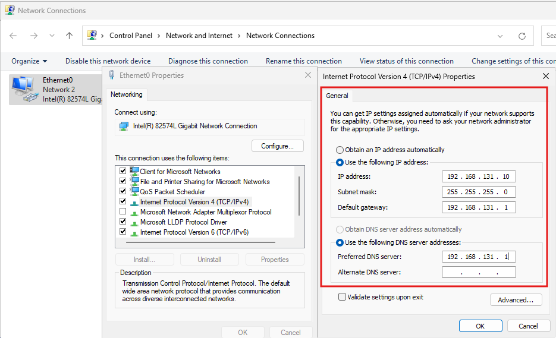

**Screenshot:** Ping validation (pfSense, WIN10-01, internet)  
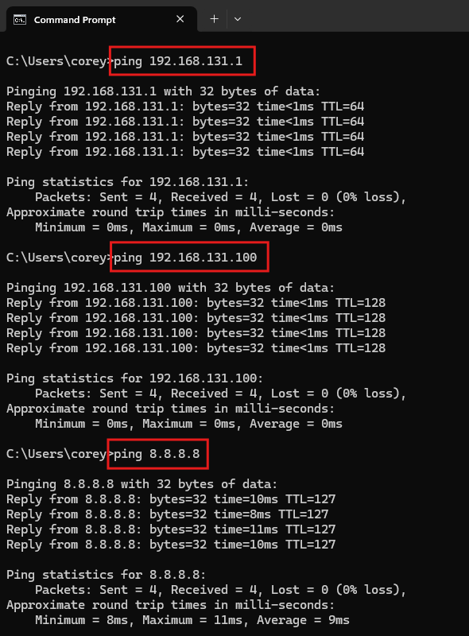

---

### Step 2 – Install AD DS + DNS roles

Installed the required Windows Server roles for Active Directory and DNS.

**Screenshot:** AD DS + DNS roles selected  
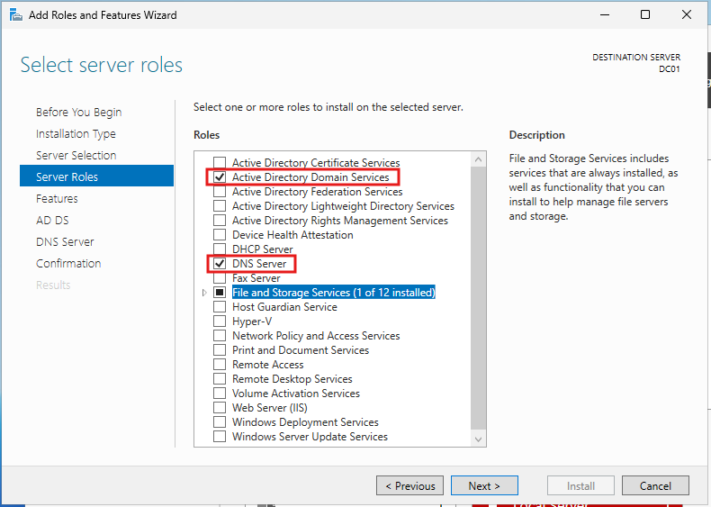

---

### Step 3 – Promote DC01 to a Domain Controller (home.lab)

Created a new forest and promoted DC01. A DNS delegation warning appeared, which is expected in standalone lab environments.

**Screenshot:** New forest domain name (home.lab)  
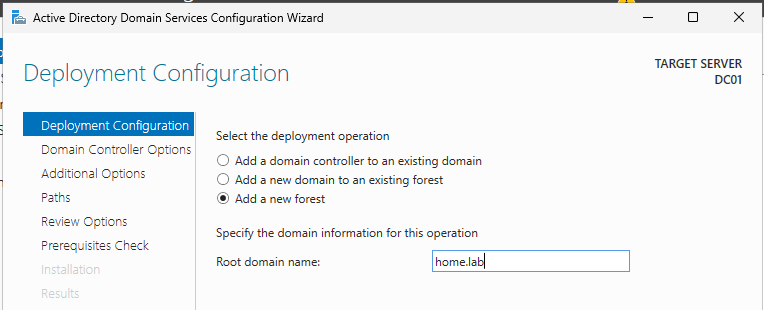

**Screenshot:** Promotion completed successfully  
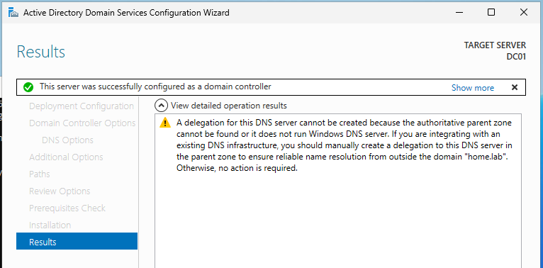

---

### Step 4 – Post-promotion DNS validation

Set DC01 to use itself for DNS and verified internal (`home.lab`) and external (`google.com`) resolution.

**Screenshot:** DC01 resolves home.lab and google.com  
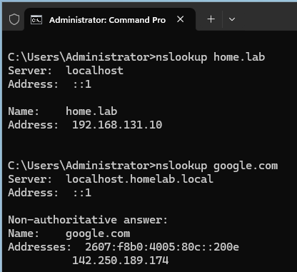

**Screenshot:** DNS zones running (AD-integrated)  

---

### Step 5 – DHCP DNS cutover + endpoint verification

Updated pfSense DHCP to hand out DC01 as DNS, then confirmed WIN10-01 received the new DNS server and could resolve names.

**Screenshot:** pfSense DHCP DNS set to DC01  
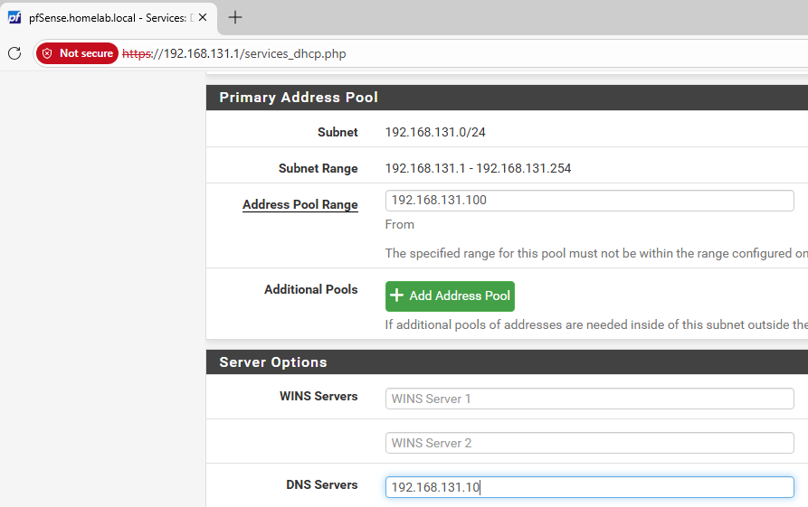

**Screenshot:** WIN10-01 receiving DNS from DC01  
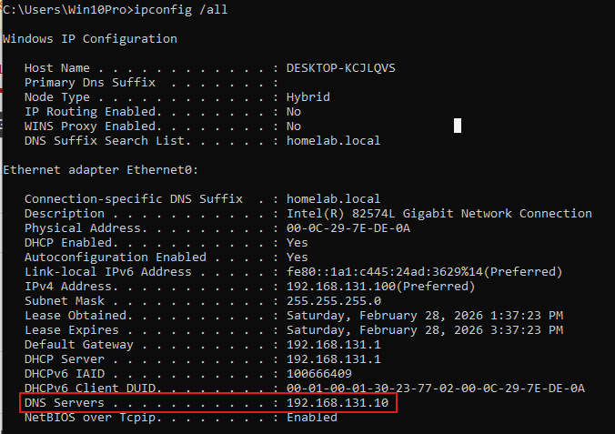

---

### Step 6 – Join WIN10-01 to the domain and verify

Joined WIN10-01 to `home.lab` and confirmed domain authentication context.

**Screenshot:** Domain join success message  
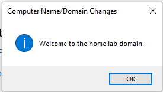

**Screenshot:** Domain sign-in and verification (`whoami`)  
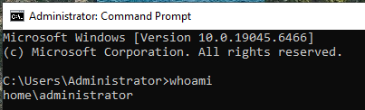

---

### Step 7 – OU structure + workstation organization

Created a basic OU structure and moved WIN10-01 into the Workstations OU.

**Screenshot:** OU structure  
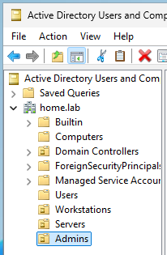

**Screenshot:** WIN10-01 placed in Workstations OU  
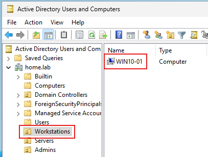

---

## Validation & Results

This project was considered successful when:

- DC01 successfully promoted to a Domain Controller and DNS was running
- Internal and external DNS resolution worked from DC01
- pfSense DHCP issued DC01 as DNS to LAN clients
- WIN10-01 joined the domain and authenticated as a domain user
- WIN10-01 appeared in AD and was organized into the Workstations OU

---

## Challenges & Observations

- Domain promotion prerequisites initially failed due to an empty local Administrator password; setting a password resolved the issue.
- ICMP traffic to WIN10-01 was blocked until the Windows Defender Firewall inbound ICMPv4 rule was enabled.
- DNS delegation warnings are expected when building a new forest in a standalone lab.

---

## What I Learned

This project helped reinforce:

- How AD DS and DNS work together to support domain identity and authentication
- Why DCs should use themselves for DNS and clients should use the DC for stability
- The importance of validating connectivity and DNS resolution before and after major changes
- How host firewall rules can impact troubleshooting

---

## Security Relevance

In a SOC environment, this type of foundational build supports:

- Identity-focused investigations and alert context (user/device/domain)
- Authentication telemetry for detections (failed logons, lockouts, account changes)
- GPO-based audit policy and logging baselines (next step)
- Centralized log collection and alerting once SIEM agents are deployed (next step)

---
