# DVWA Server Deployment and Wazuh Agent Integration

## Overview

This project documents the deployment of a monitored DVWA web server in the DMZ segment of my SOC homelab.

The objective of this project was to:

- Deploy a dedicated Ubuntu Server VM in the DMZ to host DVWA
- Configure static networking and pfSense firewall rules for controlled connectivity
- Install and configure the Apache, MariaDB, and PHP web stack required for DVWA
- Deploy DVWA and confirm it was reachable and functional in the browser
- Install the Wazuh agent on the DVWA server
- Validate that local system and web logs from the DVWA server were visible in Wazuh

This lab was built in a controlled environment to create a realistic vulnerable web server that can later be used for web attack simulations, log analysis, and SOC-style investigations.

---

## Environment

Systems involved in this project:

- **Web Server:** Ubuntu Server 24.04.4
- **Web Application:** Damn Vulnerable Web Application (DVWA)
- **Firewall:** pfSense Community Edition
- **Monitoring Platform:** Wazuh (all-in-one deployment on Ubuntu Server)
- **Attacker / Test System:** Kali Linux
- **Network Placement:** DMZ segment on **VMnet 3**

---

## Project Goal

The goal of this project was to build a dedicated DVWA server in the DMZ and integrate it into my monitoring workflow with Wazuh so it could serve as both a vulnerable web application target and a monitored Linux web server for future attack investigation labs.

---

## Implementation Summary

High-level summary of what was configured or tested:

- Created a new Ubuntu Server VM for DVWA and placed it on **VMnet 3 / DMZ**
- Assigned the server a static IP address in the DMZ subnet
- Created pfSense DMZ rules to allow the server to communicate as needed
- Installed Apache, MariaDB, PHP, and related dependencies
- Downloaded and configured DVWA in the Apache web root
- Created the DVWA MariaDB database and user
- Confirmed DVWA loaded and the database setup completed successfully
- Installed the Wazuh agent on the DVWA server
- Confirmed the agent checked in to the Wazuh dashboard
- Verified that local Apache and system logs were present and visible in Wazuh

---

## Step-by-Step Process

### Step 1 – Created the DVWA server VM and placed it in the DMZ

I created a new Ubuntu Server VM to host DVWA and configured its network adapter to use **VMnet 3**, which is the DMZ segment in my homelab.

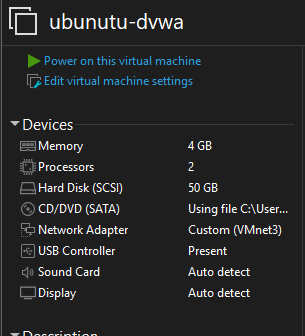

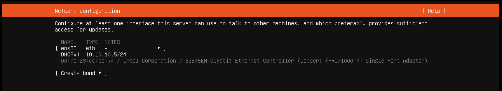

This gave the server a dedicated position in the DMZ so it could later be accessed and monitored as a separate web application target.

---

### Step 2 – Configured static networking on the DVWA server

After installation, I configured a static IP address for the DVWA server using netplan so the system would keep a consistent address for pfSense rules, Wazuh monitoring, and future testing.

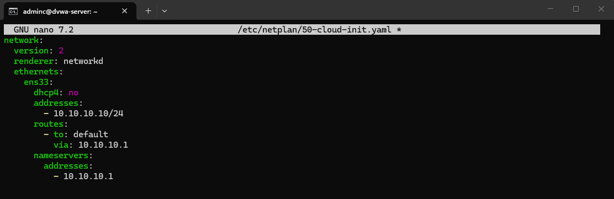

At first, connectivity to the gateway was blocked by pfSense, which showed that the Linux network configuration was correct and the remaining issue was firewall policy.

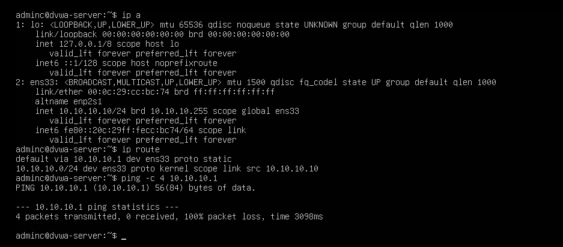

---

### Step 3 – Added pfSense DMZ rules for the DVWA server

To allow the new server to function correctly in the DMZ, I created pfSense rules to permit the traffic it needed for management and application setup.

These rules allowed the DVWA server to communicate with the gateway and access required services while still keeping the DMZ segmented.

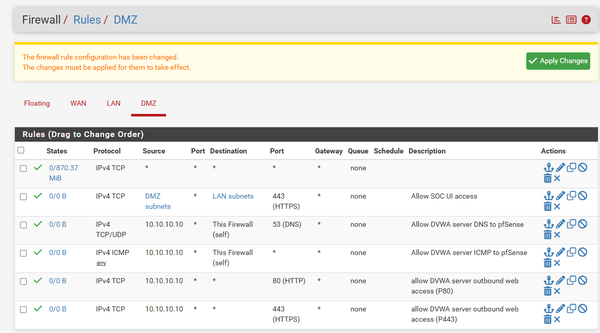

After the rules were applied, I retested connectivity and confirmed the server could reach the DMZ gateway successfully.

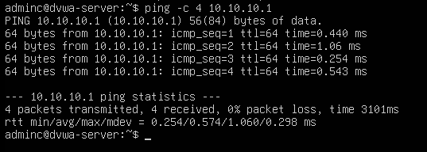

---

### Step 4 – Installed the web application stack

With networking working, I updated the server and installed the packages required to host DVWA:

- Apache
- MariaDB
- PHP
- supporting PHP modules

I first confirmed that package updates were working correctly.

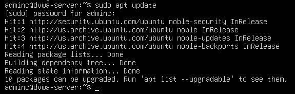

Then I installed the full web stack required for DVWA.

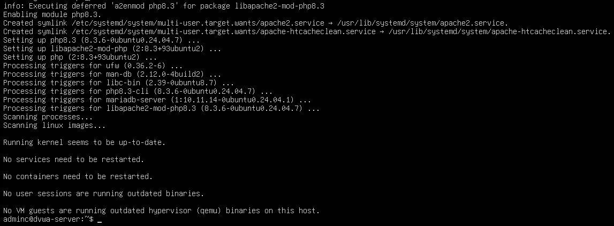

After installation, I verified that both Apache and MariaDB were running.

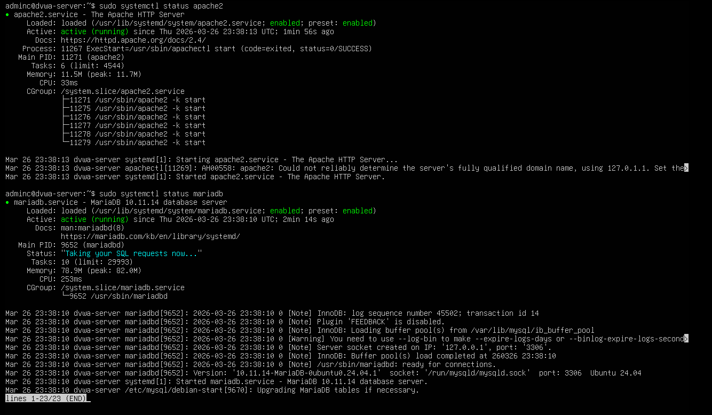

I also confirmed Apache was serving the default page locally before deploying DVWA.

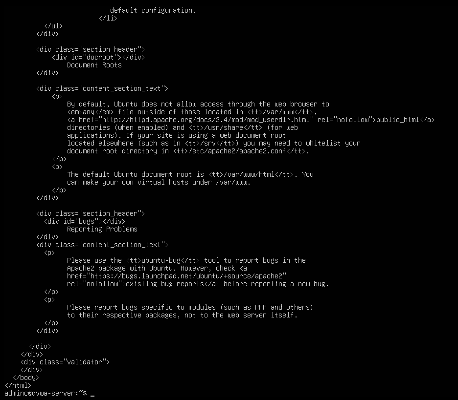

---

### Step 5 – Downloaded and deployed DVWA

Once the web stack was ready, I downloaded DVWA directly to the server and extracted it into the Apache web root.

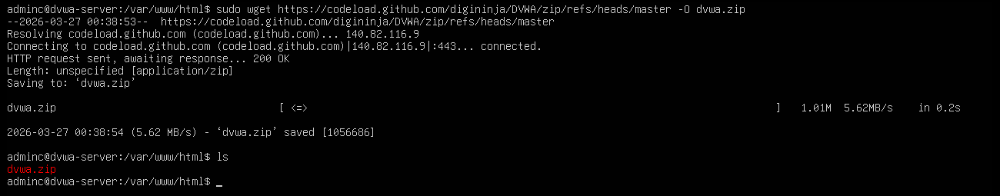

I then verified that the DVWA files were in place under `/var/www/html/dvwa`.

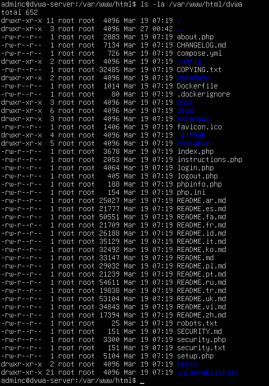

After deployment, I adjusted ownership and file permissions so Apache could serve the application and DVWA could write to the required directories.

---

### Step 6 – Created the DVWA database and updated the application config

To support DVWA, I created a MariaDB database and a dedicated database user for the application.

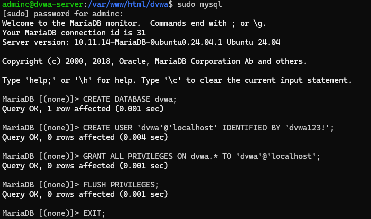

I then copied the default DVWA configuration file and updated the database connection values to use the new database, user, and password.

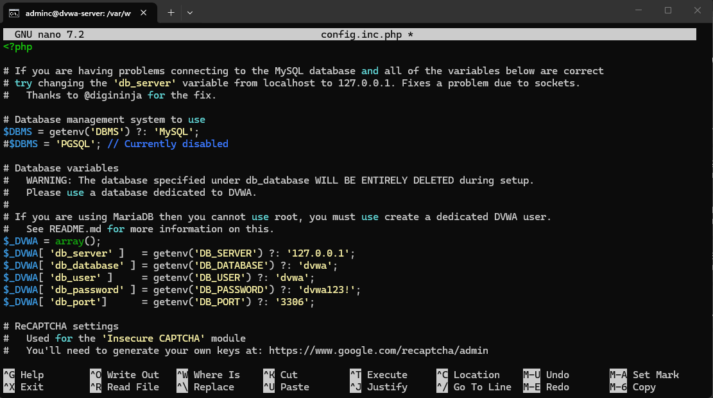

This completed the application-side configuration required before the browser-based setup page could create the schema.

---

### Step 7 – Completed DVWA setup in the browser

After the server-side configuration was finished, I browsed to the DVWA setup page from my lab and confirmed the application was reachable.

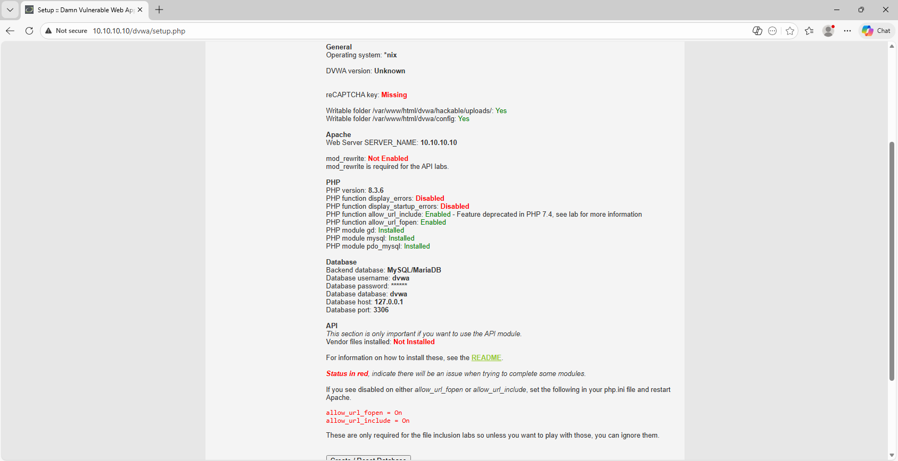

I then used the setup page to create/reset the DVWA database and proceeded to the login page.

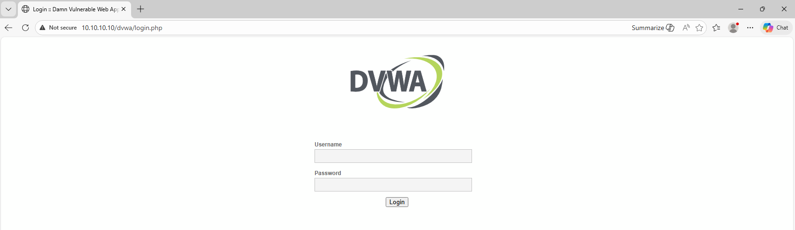

After logging in with the default credentials, I confirmed that the DVWA homepage loaded successfully.

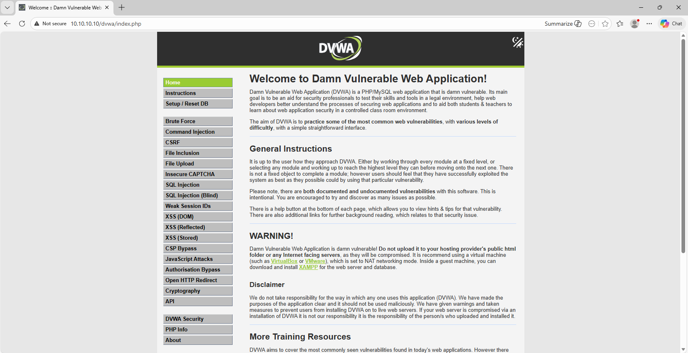

At this point, the vulnerable web application was fully deployed and accessible in the DMZ.

---

### Step 8 – Installed the Wazuh agent on the DVWA server

With DVWA working, I installed the Wazuh agent on the new server so the host could be monitored from the Wazuh dashboard.

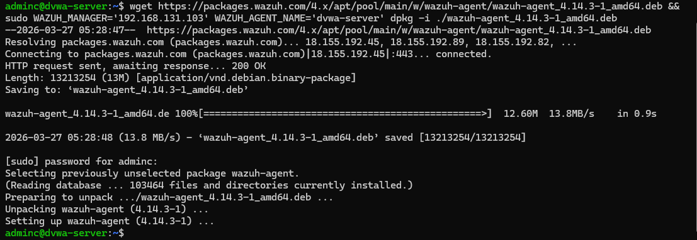

After installation, I enabled and started the agent service and verified that it was running correctly on the server.

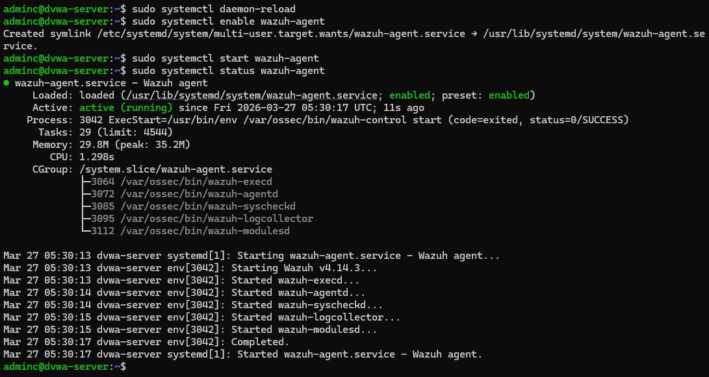

I then confirmed in the Wazuh dashboard that the new agent `dvwa-server` had checked in and was connected successfully.

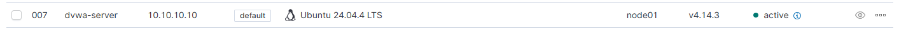

---

### Step 9 – Validated local logs and Wazuh visibility

To make sure the server was not only connected but actually useful as a monitored asset, I verified that relevant logs existed locally on the DVWA server.

I checked Apache log files and confirmed that access log entries were being created from DVWA page visits.

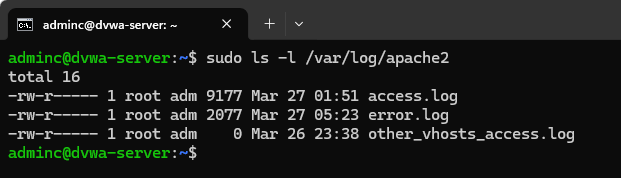

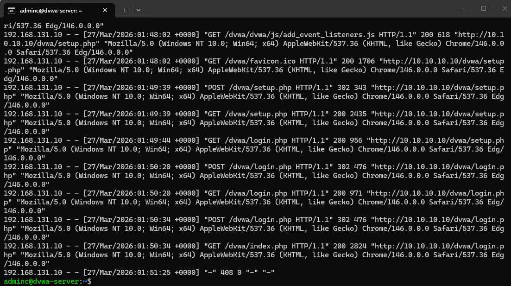

I also reviewed system authentication logs to confirm normal Linux host activity was being recorded.

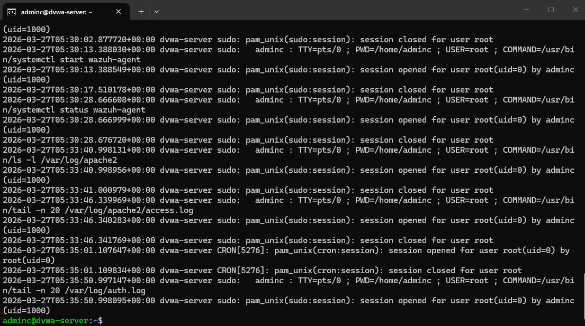

Finally, I confirmed that logs from the DVWA server were showing up in Wazuh, proving that the host had become a monitored web server in my homelab.

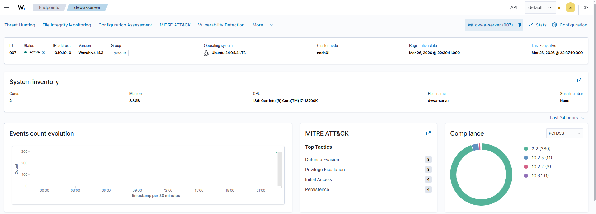

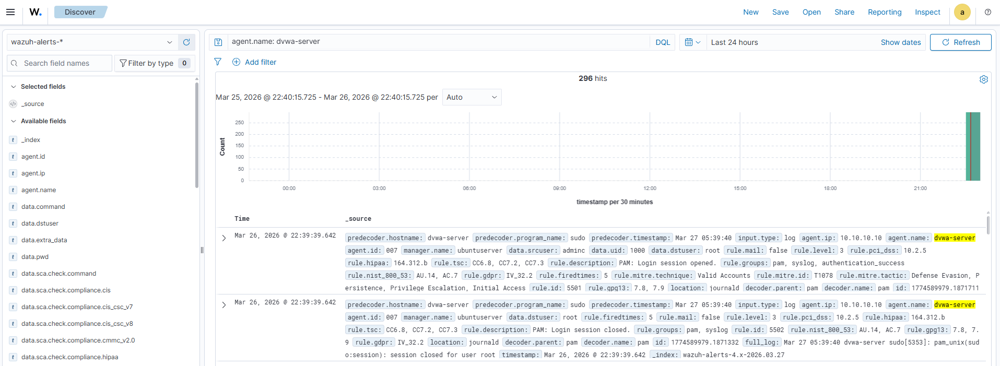

---

## Validation & Results

This project was considered successful when:

- The Ubuntu Server VM was deployed and placed on the DMZ network
- A static IP address was configured successfully
- pfSense DMZ rules allowed the server to function correctly
- Apache, MariaDB, and PHP were installed and running
- DVWA was deployed and accessible in the browser
- The DVWA database was created and the application setup completed
- The Wazuh agent installed and checked in successfully
- Local Apache and system logs were confirmed on the server
- Logs from `dvwa-server` were visible in Wazuh

---

## Challenges & Observations

One of the first issues I ran into was that the DVWA server could not initially reach the DMZ gateway after the static IP configuration was applied. This turned out to be a pfSense rule issue rather than a Linux networking issue, which reinforced the importance of validating both host configuration and firewall policy during deployment.

I also ran into a few deployment issues while downloading DVWA and adjusting file permissions, including incorrect download commands and version-specific differences in some file paths. Working through those issues was useful because it reinforced the need to validate paths and outputs directly instead of assuming every install will match an older guide exactly.

---

## What I Learned

This project helped reinforce:

- How to deploy a dedicated Linux web server into a segmented DMZ
- How static IP addressing and firewall rules work together during service deployment
- How to install and configure the Apache/MariaDB/PHP stack for a vulnerable web application lab
- How to deploy DVWA and complete the browser-based database setup
- How to install and validate a Wazuh agent on a newly deployed Linux server
- The importance of confirming both local log creation and SIEM visibility

---

## Security Relevance

In a SOC environment, this type of work supports:

- Building monitored assets for realistic attack simulation
- Centralized monitoring of Linux web servers
- Collection of Apache and host-based logs for investigation
- Visibility into vulnerable web application activity
- Preparation for future web attack detection, correlation, and triage exercises

This project established the web server that I plan to use in later labs involving DVWA attacks and Wazuh-based investigation workflows.
