# GPO Audit Baseline (DC01 + WIN10-01)

## Overview

This project documents hands-on work completed in my SOC homelab environment.

The objective of this project was to:

- Create separate audit-focused GPOs for domain controllers and workstations
- Apply Advanced Audit Policy settings to generate SOC-relevant Windows security telemetry
- Validate GPO application and confirm log visibility in Wazuh

This lab was built in a controlled environment to improve the quality and consistency of Windows logging for future detection engineering and investigation exercises.

---

## Environment

Systems involved in this project:

- Firewall: pfSense
- SIEM / Logging Platform: Wazuh
- Endpoint(s): Windows Server 2025 (DC01), Windows 10 Pro (WIN10-01)
- Monitoring Tools: Group Policy Management (GPMC), gpresult, Wazuh Discover
- Network Segmentation (if applicable): LAN

---

## Project Goal

The goal of this project was to create a logging baseline using Group Policy so that authentication and account management activity consistently produces useful audit events across the domain controller and workstation.

---

## Implementation Summary

High-level summary of what was configured or tested:

- Created and configured a Domain Controllers audit GPO
- Created and configured a Workstations audit GPO
- Enabled key Advanced Audit Policy subcategories (logon/account management/policy change)
- Forced policy updates and verified applied GPOs using gpresult
- Validated successful log ingestion in Wazuh using logon event IDs (4624/4625)

---

## Evidence (Screenshots + Descriptions)

**Domain controller audit settings: Account Logon subcategories enabled (Kerberos/Credential validation).**  
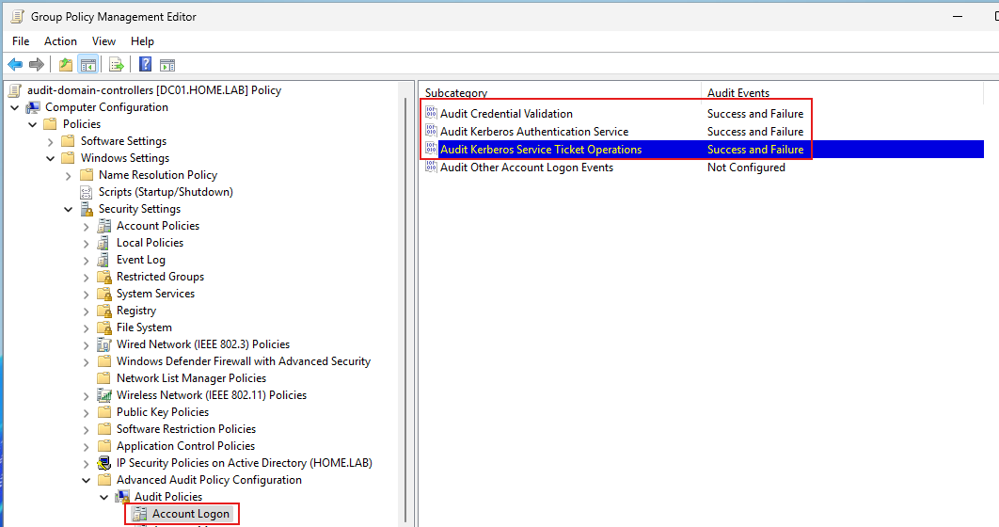

**Domain controller audit settings: Account Management subcategories enabled (user/group/computer changes).**  
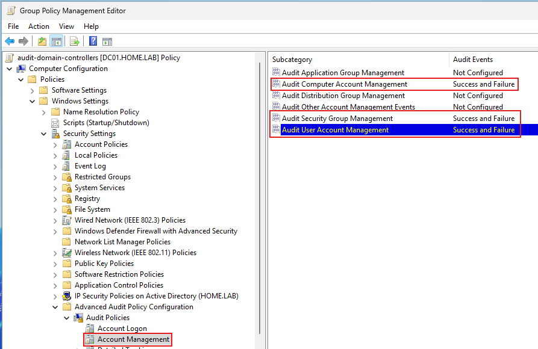

**Domain controller audit settings: Logon/Logoff subcategories enabled (logon + special logon).**  
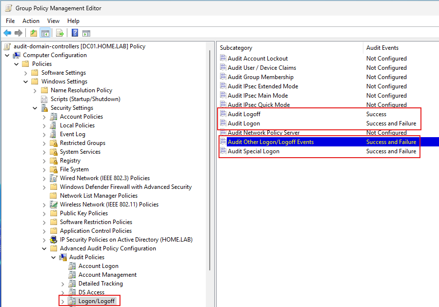

**Domain controller audit settings: Directory Service Changes enabled (DS Access).**  
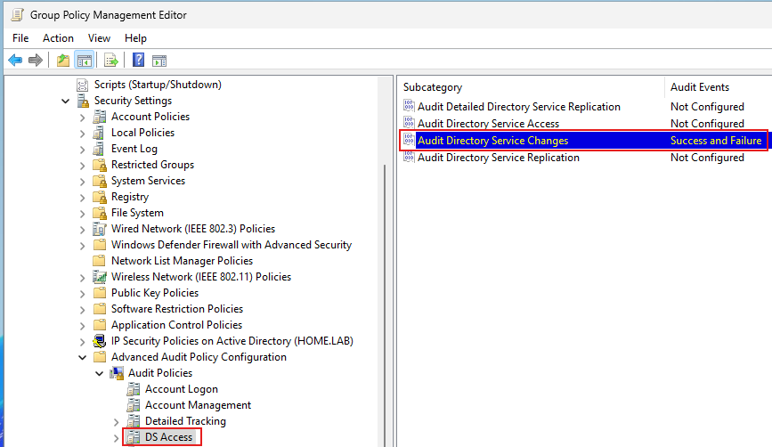

**Domain controller audit settings: Audit Policy Change enabled (Policy Change).**  
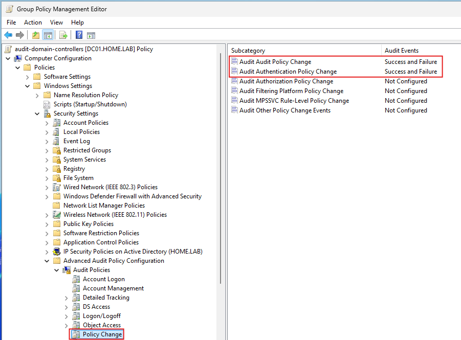

**Workstation audit settings: Process Creation enabled (Detailed Tracking).**  
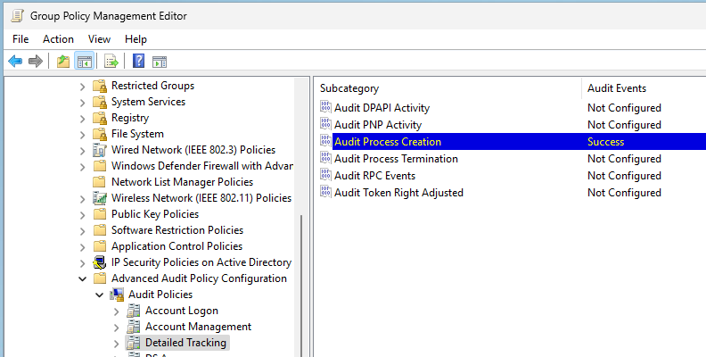

**Workstation audit settings: Audit Policy Change enabled (Policy Change).**  
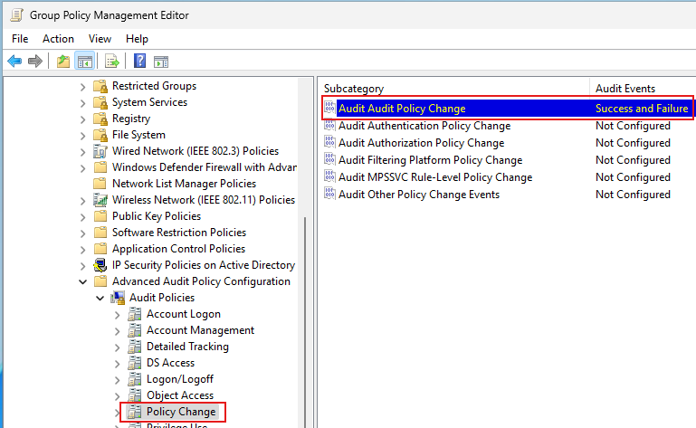

**DC01 policy update + gpresult verification showing the DC audit GPO applied.**  
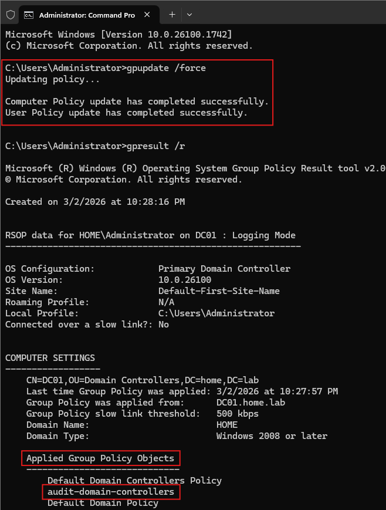

**WIN10-01 policy update + gpresult verification showing the workstation audit GPO applied.**  
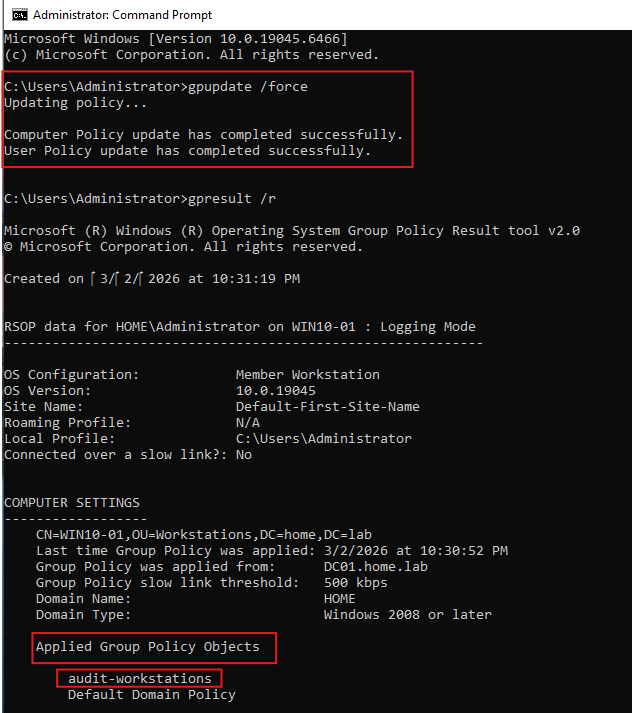

**Wazuh validation: DC01 logon events visible (4624/4625) after audit policy baseline.**  
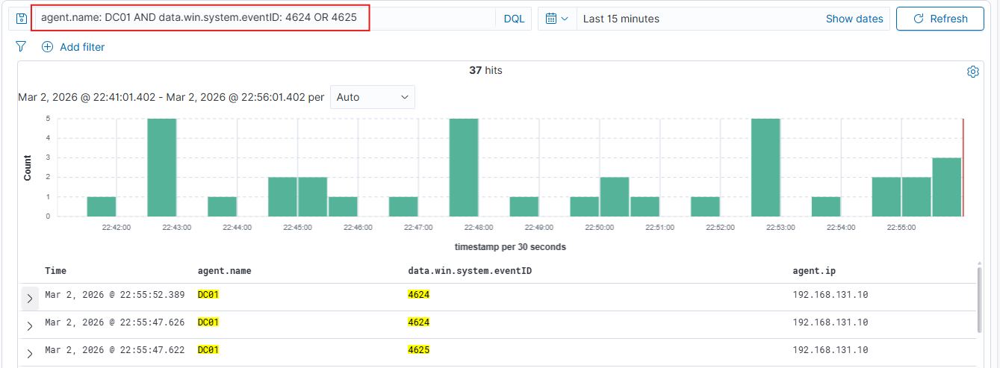

**Wazuh validation: WIN10-01 logon events visible (4624/4625) after audit policy baseline.**  
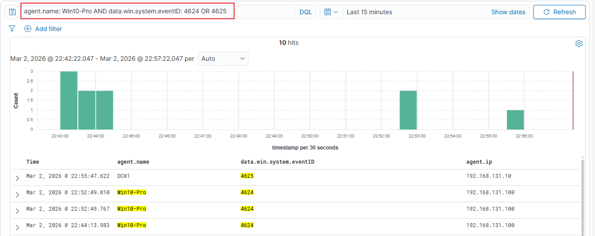

---

## Validation & Results

This project was considered successful when:

- GPOs applied successfully to both DC01 and WIN10-01 (verified via gpresult)
- Audit policy settings generated expected authentication telemetry
- Relevant Windows logon events (4624/4625) were visible in Wazuh for both systems
- No stability issues occurred after applying the GPOs

---

## Challenges & Observations

- “Directory Service Access” appears as **DS Access** in the Advanced Audit Policy tree, which can be easy to miss.
- It was important to verify GPO application locally with gpresult before troubleshooting Wazuh ingestion.

---

## What I Learned

This project helped reinforce:

- How Advanced Audit Policy settings improve the quality of Windows security telemetry
- Why domain controllers and workstations should have separate audit baselines
- The value of validating policy application before assuming ingestion issues
- How to confirm log visibility in a SIEM using targeted event IDs

---

## Security Relevance

In a SOC environment, this baseline supports:

- Authentication monitoring (success/failure logons, lockouts, Kerberos-related activity)
- Account and group change monitoring (privileged access tracking)
- Policy change visibility (audit policy modifications and related changes)
- Better detection engineering and triage using consistent Windows audit telemetry

---
