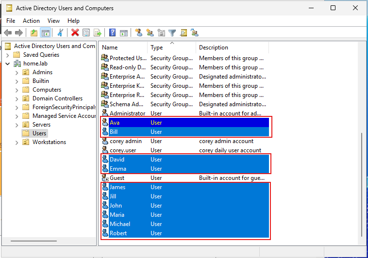
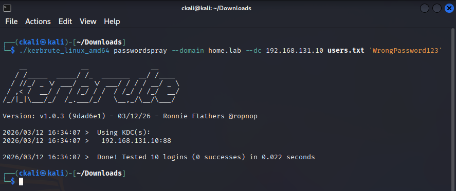
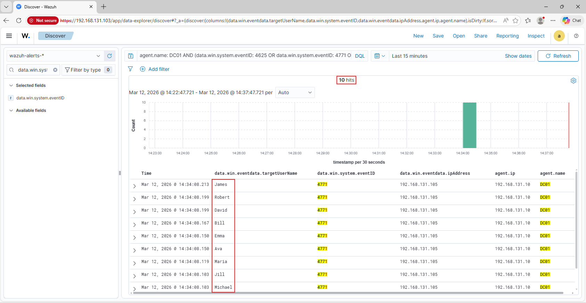
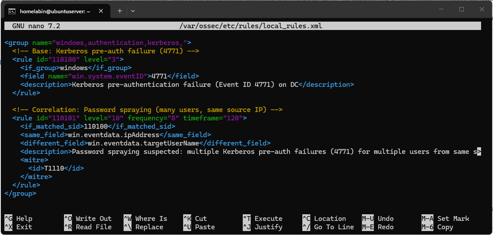
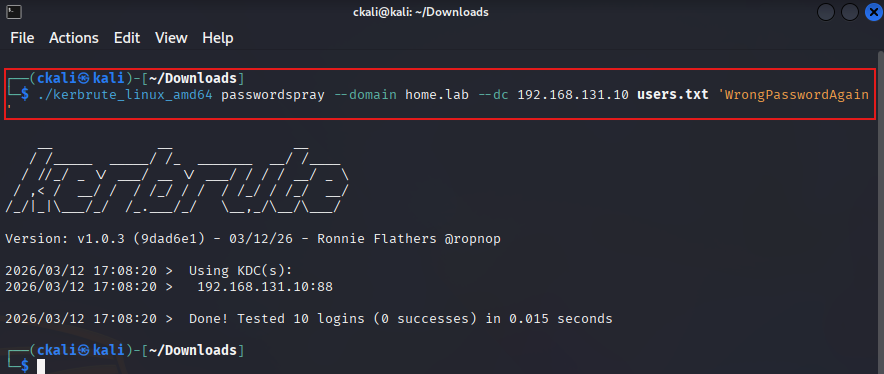
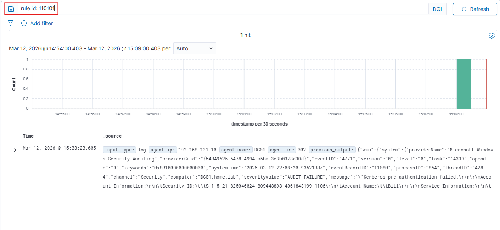
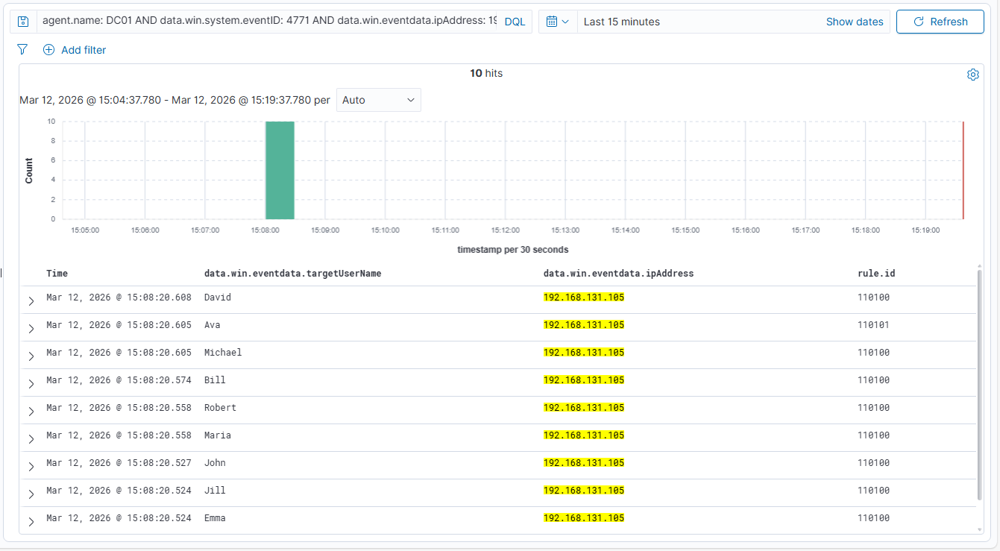

# Password Spraying Detection (Kerberos 4771) – Kali → DC01

## Overview

This project documents hands-on work completed in my SOC homelab environment.

The objective of this project was to:

- Generate password-spraying authentication failures from Kali against an AD domain controller
- Confirm the DC-side Kerberos failure events were ingested into Wazuh
- Build and validate a correlation rule to detect password spraying behavior

This lab was built in a controlled environment to better understand how security events are generated, ingested, and analyzed in a SOC-style workflow.

---

## Environment

Systems involved in this project:

- Firewall: pfSense
- SIEM / Logging Platform: Wazuh
- Endpoint(s): Windows Server (DC01) + domain users (targets)
- Monitoring Tools: Wazuh Discover, Wazuh local_rules.xml, Kali Linux (Kerbrute)
- Network Segmentation (if applicable): LAN

---

## Project Goal

The goal of this project was to simulate password spraying (one password tested across many accounts) and create a detection that identifies the pattern: **multiple Kerberos pre-auth failures for different users from the same source IP within a short time window**.

---

## Implementation Summary

High-level summary of what was configured or tested:

- Generated Kerberos authentication failures (Event ID 4771) from Kali
- Confirmed log ingestion on DC01 via Wazuh
- Built correlation logic (same source IP + different usernames + frequency/timeframe)
- Validated alert behavior using repeatable spray traffic

---

## Step-by-Step Process

### Step 1 – Create test users for spray targets (AD)

Created multiple standard domain users to act as spray targets.

**Domain users created in ADUC (spray targets).**

---

### Step 2 – Run password spraying from Kali (Kerbrute)

Used Kerbrute to test a single incorrect password against many usernames, targeting the DC.

**Kerbrute passwordspray executed against `home.lab` DC (0 successes).**

---

### Step 3 – Confirm DC01 evidence in Wazuh (Kerberos 4771)

Validated that DC01 received multiple Kerberos pre-authentication failures (Event ID 4771), with many usernames tied to the same source IP (Kali).

**Wazuh Discover view of DC01 4771 events during the spray window.**

---

### Step 4 – Configure detection logic (Wazuh correlation rule)

Added two local Wazuh rules:
- Base rule to match Kerberos pre-auth failures (4771)
- Correlation rule to detect spraying: **same source IP** + **different usernames** + **frequency/timeframe**

**Local rule added to `local_rules.xml`.**

---

### Step 5 – Validation (re-run spray and confirm alert fired)

Re-ran Kerbrute after the rule was loaded and confirmed the correlation rule triggered.

**Kerbrute spray executed again to trigger detection.**

**Wazuh showing a hit for the correlation rule (rule.id 110101).**

**Evidence view showing multiple usernames from the same source IP, plus base and correlation rule IDs.**

---

## Validation & Results

This project was considered successful when:

- Relevant DC authentication failures (4771) were visible in Wazuh during the test window
- Detection logic correctly matched password spraying behavior (same src IP + many usernames)
- The correlation rule triggered under the defined frequency/timeframe
- Systems remained stable after rule deployment and testing

---

## Challenges & Observations

- Correlation alerts may only show one “current” username field even though multiple usernames contributed to the correlation; the full pattern is best validated by reviewing the underlying DC events (4771) for the same source IP and multiple target users.
- It was important to validate the evidence in Wazuh before assuming the rule was broken (the rule did fire; the issue was where it was being viewed).

---

## What I Learned

This project helped reinforce:

- How Kerberos pre-authentication failures (4771) can reflect password spraying behavior
- The importance of validating event fields (source IP + target username) before writing correlation logic
- How correlation rules differ from single-event alerts and may summarize multiple events
- How to validate a detection with repeatable test traffic

---

## Security Relevance

In a SOC environment, this type of detection supports:

- Password spraying monitoring and early detection of credential access attempts
- Investigation pivots based on source IP, targeted accounts, and time window
- Alert triage workflows for identity-based threats in Active Directory environments
- Validation that authentication telemetry from domain controllers is visible and actionable

---
