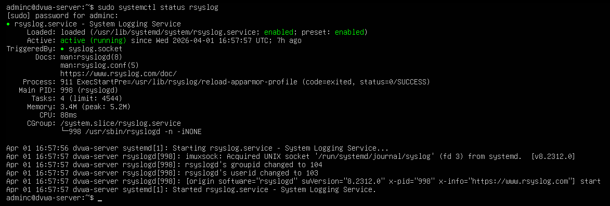
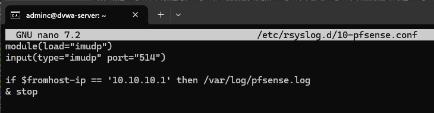
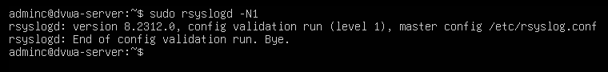
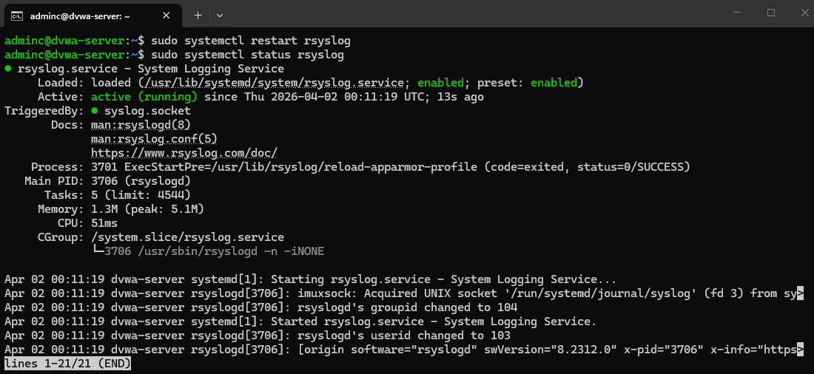
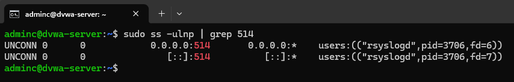
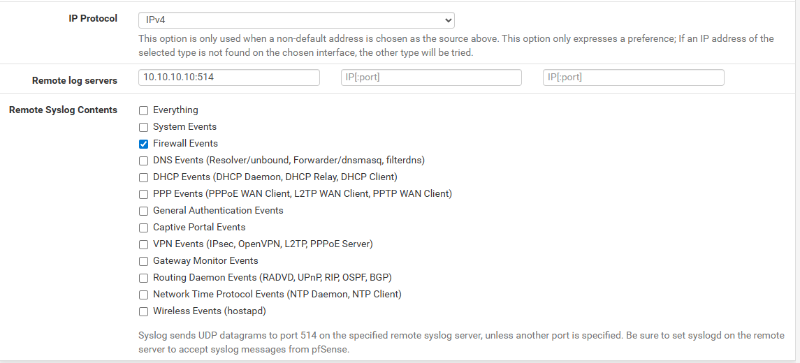
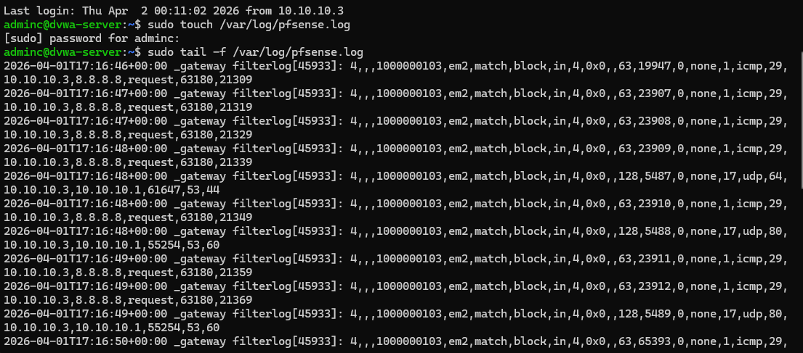
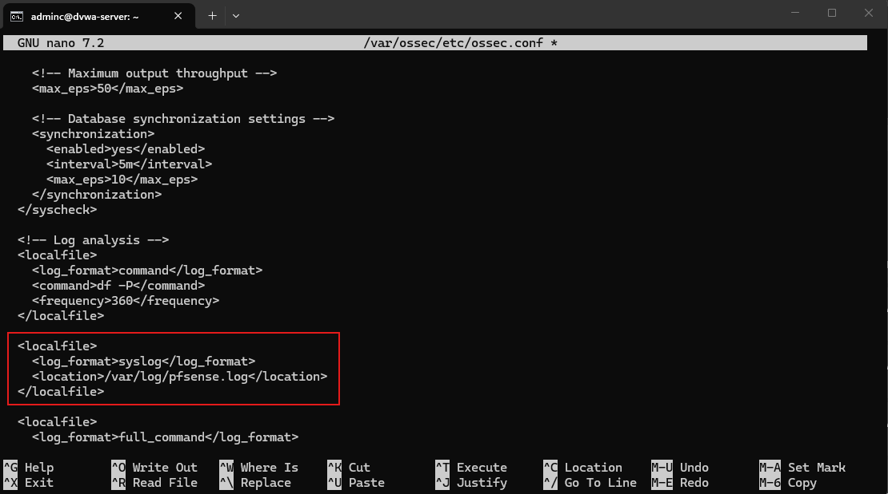
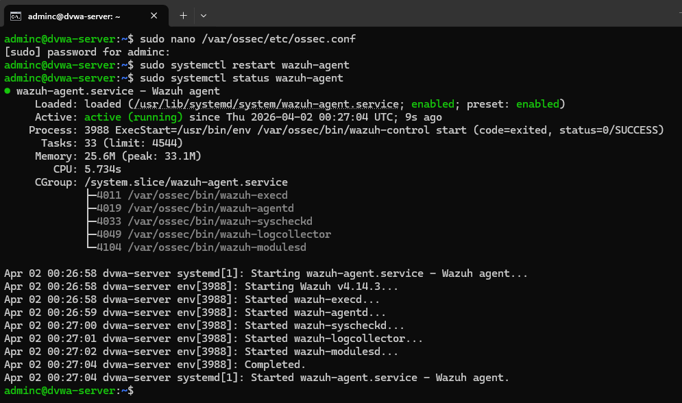
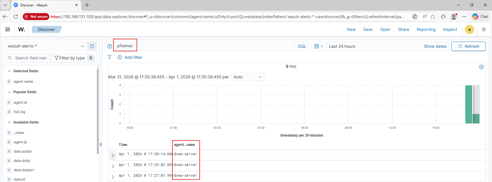

# pfSense Log Forwarding to DVWA Server

## Overview

This project documents configuring pfSense to forward firewall logs to the monitored `dvwa-server` in the DMZ.

The objective of this project was to:

- Configure `dvwa-server` as a syslog receiver for pfSense firewall events
- Forward pfSense firewall logs to the DVWA server over UDP 514
- Store the forwarded logs in `/var/log/pfsense.log`
- Configure the Wazuh agent on `dvwa-server` to monitor the forwarded pfSense log file
- Confirm that pfSense firewall events were visible in Wazuh under the `dvwa-server` agent

This lab was completed to improve the architecture for future DVWA attack investigations by keeping pfSense, Apache, and Linux host telemetry tied to the same monitored system.

---

## Environment

Systems involved in this project:

- **Firewall:** pfSense Community Edition
- **Syslog Receiver:** `dvwa-server` (Ubuntu Server in the DMZ)
- **Web Application Host:** DVWA on Apache
- **Monitoring Platform:** Wazuh
- **Agent Monitored Host:** `dvwa-server`
- **Network Placement:** `dvwa-server` on **VMnet 3 / DMZ**

---

## Project Goal

The goal of this project was to move pfSense firewall log forwarding from the Wazuh server to the monitored DVWA server so pfSense firewall events could be collected on the same host that already contained DVWA web logs and Linux system logs.

This created a cleaner setup for future cross-source investigation labs involving:

- pfSense firewall logs
- Apache access logs
- Linux/auth logs
- Wazuh events tied to the same host

---

## Implementation Summary

High-level summary of what was configured or tested:

- Confirmed `rsyslog` was installed and active on `dvwa-server`
- Created an rsyslog listener on UDP 514
- Configured `dvwa-server` to write pfSense syslog to `/var/log/pfsense.log`
- Updated pfSense remote logging to send firewall events to `10.10.10.10:514`
- Verified pfSense firewall logs were received on `dvwa-server`
- Added `/var/log/pfsense.log` to the Wazuh agent configuration on `dvwa-server`
- Restarted the Wazuh agent
- Confirmed pfSense events were visible in Wazuh under `agent.name = dvwa-server`

---

## Step-by-Step Process

### Step 1 – Verified rsyslog was available on the DVWA server

Before forwarding pfSense logs to `dvwa-server`, I first confirmed that `rsyslog` was already installed and running on the system.

This confirmed the server was ready to act as a syslog receiver.

---

### Step 2 – Configured dvwa-server to listen for pfSense syslog

I created a dedicated rsyslog configuration file on `dvwa-server` so the host would listen on UDP 514 and write pfSense logs to `/var/log/pfsense.log`.

After creating the configuration, I validated the syntax to confirm the file was correct.

I then restarted rsyslog and confirmed the service was active and listening on UDP 514.

---

### Step 3 – Updated pfSense remote logging to point to dvwa-server

After confirming `dvwa-server` was ready to receive syslog, I updated the pfSense remote logging settings to send **Firewall Events** to the DVWA server on `10.10.10.10:514`.

This changed the pfSense forwarding destination from the Wazuh server to the monitored DVWA host.

---

### Step 4 – Confirmed pfSense logs were received on dvwa-server

With pfSense remote logging updated, I monitored `/var/log/pfsense.log` on `dvwa-server` and confirmed that pfSense firewall events were being written to the file successfully.

At this point, the log forwarding path from pfSense to the DVWA server was working correctly.

---

### Step 5 – Configured the Wazuh agent on dvwa-server to monitor pfSense logs

Once the logs were reaching `dvwa-server`, I added `/var/log/pfsense.log` to the local file monitoring section of the Wazuh agent configuration so the agent would collect those pfSense events and forward them into Wazuh.

After that, I restarted the Wazuh agent and verified that the service came back up correctly.

---

### Step 6 – Confirmed pfSense events were visible in Wazuh from dvwa-server

After restarting the Wazuh agent, I searched in Wazuh and confirmed that pfSense-related events were visible under `agent.name = dvwa-server`.

This confirmed that pfSense firewall logs were now flowing through the DVWA server and into Wazuh using the agent-based collection path.

---

## Validation & Results

This project was considered successful when:

- `dvwa-server` was configured to receive syslog on UDP 514
- pfSense remote logging was updated to send firewall events to `10.10.10.10:514`
- pfSense firewall logs were written to `/var/log/pfsense.log` on `dvwa-server`
- The Wazuh agent on `dvwa-server` was configured to monitor `/var/log/pfsense.log`
- pfSense-related events were visible in Wazuh under the `dvwa-server` agent

---

## Challenges & Observations

One reason for moving pfSense forwarding to `dvwa-server` was to simplify the architecture for future investigation labs. Although forwarding directly to the Wazuh server worked earlier, using the monitored DVWA host as the syslog receiver created a cleaner and more practical setup for correlation.

This approach keeps multiple telemetry sources aligned on the same monitored system, which is especially useful for later labs involving:

- web attack traffic
- Apache access log review
- Linux host log review
- pfSense firewall log correlation

---

## What I Learned

This project helped reinforce:

- How to configure `rsyslog` as a syslog receiver on a Linux host
- How to update pfSense remote logging targets
- How to validate log forwarding at both the file and SIEM levels
- How to extend a Wazuh agent to monitor additional local log files
- Why log collection architecture matters when preparing for multi-source investigations

---

## Security Relevance

In a SOC environment, this type of setup supports:

- Collection of firewall telemetry on monitored assets
- Correlation of firewall, web server, and host logs
- Better visibility into attack activity targeting web applications
- More realistic investigation workflows across multiple log sources

This project improved the telemetry design for my homelab and prepared the environment for future DVWA web attack investigation labs using pfSense, Apache, Linux, and Wazuh together.
