> **Update:** I later moved pfSense log forwarding to my monitored `dvwa-server` host for a cleaner architecture and better correlation with DVWA web logs. See: [`../pfsense-log-forwarding-to-dvwa/`](../pfsense-log-forwarding-to-dvwa/)

# pfSense Remote Log Forwarding to Wazuh Server

## Overview

This project documents hands-on work completed in my SOC homelab environment.

The objective of this project was to:

- Configure pfSense to forward firewall events to a remote syslog destination
- Receive and store forwarded pfSense logs on my Ubuntu-based Wazuh server
- Validate that test traffic from Kali was captured in the forwarded logs and ingested by Wazuh

This lab was built in a controlled environment to better understand how firewall events are generated, forwarded, collected, and reviewed in a SOC-style workflow.

---

## Environment

Systems involved in this project:

- **Firewall:** pfSense Community Edition
- **SIEM / Logging Platform:** Wazuh (all-in-one deployment on Ubuntu Server)
- **Endpoint(s):** Kali Linux
- **Monitoring Tools:** rsyslog, Wazuh logcollector, Wazuh archival logs
- **Network Segmentation (if applicable):** WAN, LAN, and DMZ separated by pfSense

---

## Project Goal

The goal of this project was to configure pfSense as a usable network telemetry source in my homelab by forwarding firewall logs to my Wazuh server, storing them in a dedicated log file, and validating that blocked traffic from Kali could be confirmed in both the forwarded logs and Wazuh archival logs.

---

## Implementation Summary

High-level summary of what was configured or tested:

- Confirmed pfSense was already generating local firewall logs
- Configured rsyslog on the Ubuntu Wazuh server to receive pfSense syslog over UDP 514
- Enabled pfSense remote logging for firewall events
- Validated that forwarded logs were written to `/var/log/pfsense.log`
- Generated test traffic from Kali with Nmap
- Configured Wazuh to monitor the forwarded pfSense log file
- Enabled Wazuh archival logging to confirm pfSense event ingestion

---

## Step-by-Step Process

### Step 1 – Verified local pfSense firewall logging

Before configuring remote forwarding, I first confirmed that pfSense was already generating local firewall logs. This established that the firewall was producing usable telemetry before any forwarding changes were made.

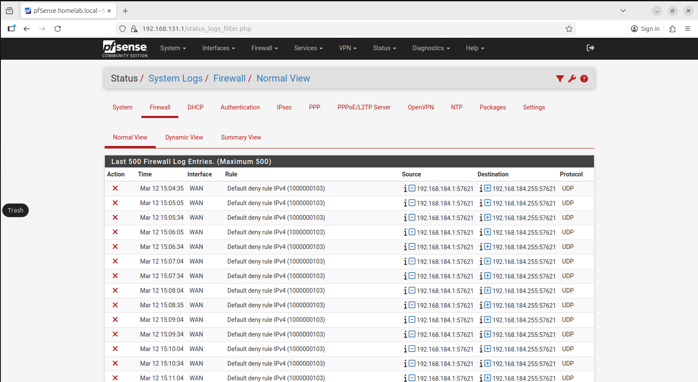

I also confirmed that remote syslog forwarding was disabled before beginning the setup.

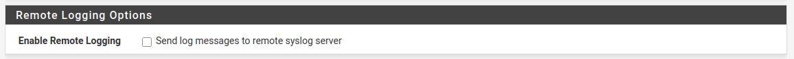

---

### Step 2 – Prepared the Ubuntu Wazuh server to receive syslog

I used the Ubuntu Wazuh server as the syslog receiver. First, I confirmed that `rsyslog` was installed and running.

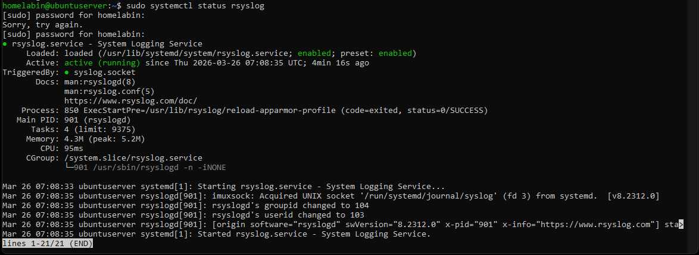

I then created a dedicated rsyslog configuration to listen on UDP 514 and write pfSense events to `/var/log/pfsense.log`.

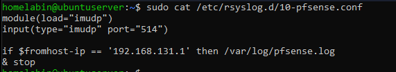

After creating the configuration, I validated the syntax and restarted the service.

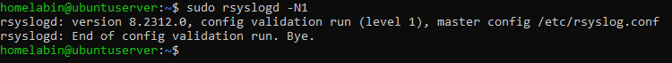

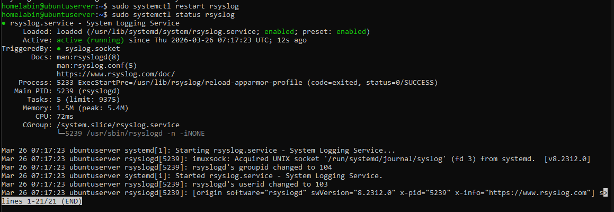

Finally, I confirmed the server was listening on UDP 514 for incoming syslog traffic.

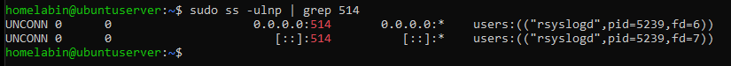

---

### Step 3 – Enabled pfSense remote logging

Once the Ubuntu receiver was ready, I enabled remote logging in pfSense and configured it to send **Firewall Events** to the Ubuntu Wazuh server on port 514.

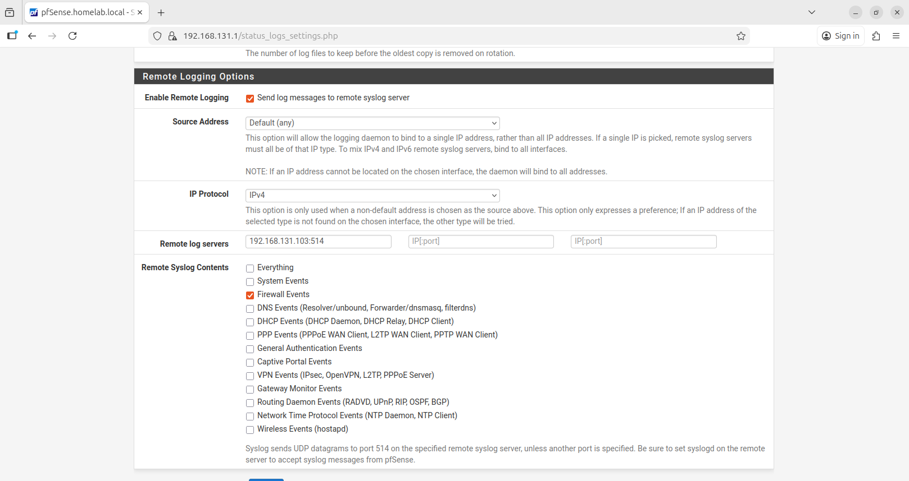

---

### Step 4 – Confirmed forwarded pfSense logs were received

After enabling remote logging, I monitored `/var/log/pfsense.log` on the Ubuntu server and confirmed that pfSense firewall logs were arriving successfully.

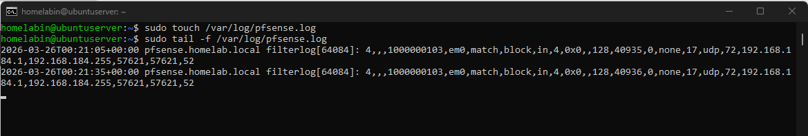

---

### Step 5 – Generated test traffic from Kali and validated forwarding

To validate the setup with fresh traffic, I used Kali on the WAN segment to run an Nmap scan against the pfSense WAN IP on ports 22, 80, and 443.

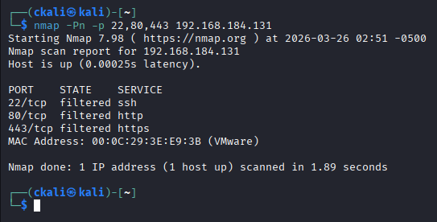

I then reviewed `/var/log/pfsense.log` again and confirmed that the scan traffic appeared as blocked firewall events in the forwarded log file.

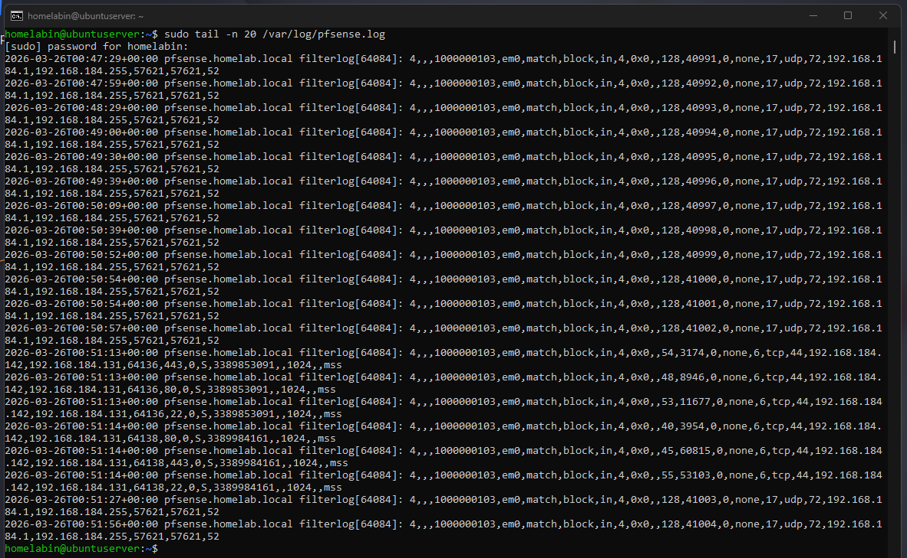

---

### Step 6 – Configured Wazuh to monitor the pfSense log file

To extend the project beyond raw syslog forwarding, I updated the Wazuh server configuration so it would monitor `/var/log/pfsense.log` as a local syslog source.

Before making changes, I reviewed the relevant section of `ossec.conf`.

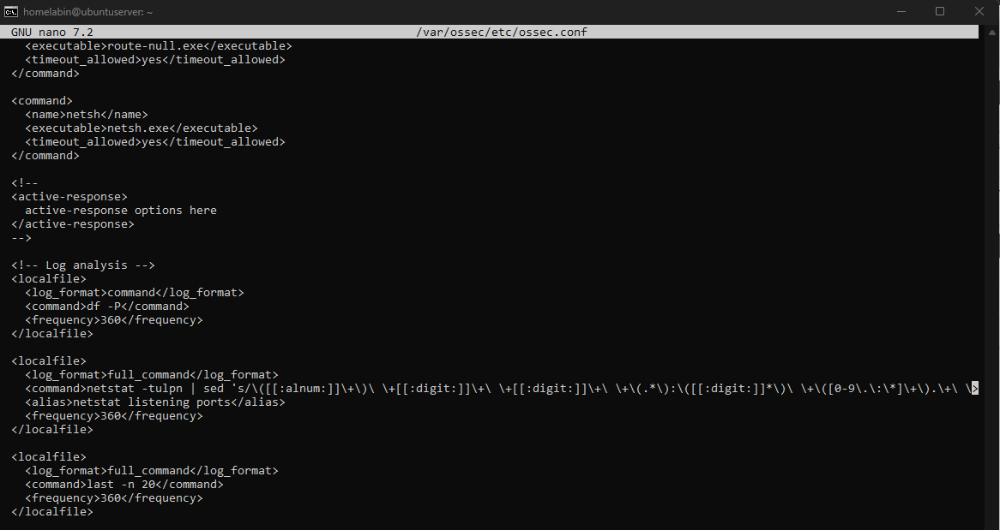

I then added a new `<localfile>` entry for `/var/log/pfsense.log`.

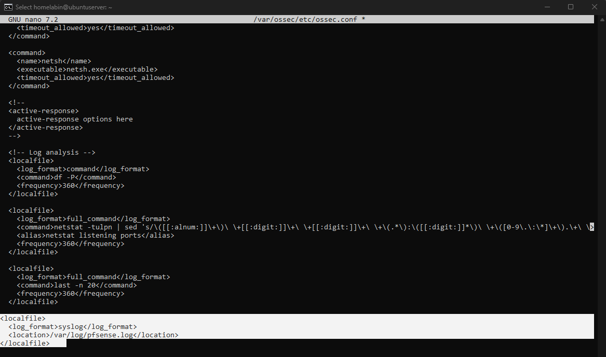

After that, I restarted the Wazuh manager to apply the configuration.

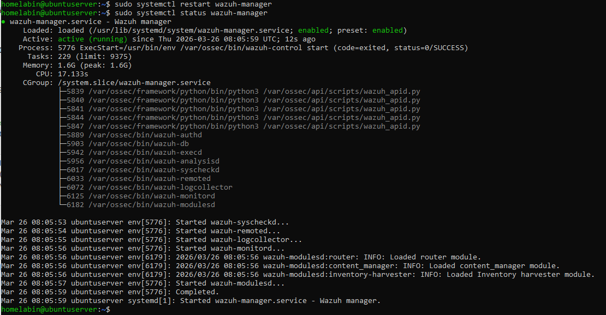

---

### Step 7 – Enabled Wazuh archival logging and confirmed event ingestion

To verify whether pfSense events were being retained by Wazuh, I checked the `logall` and `logall_json` settings in `ossec.conf`. They were initially disabled, so I enabled them for validation.

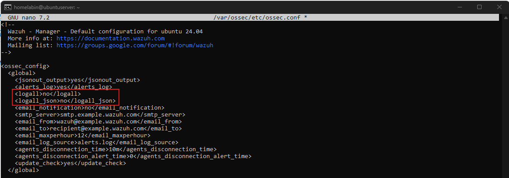

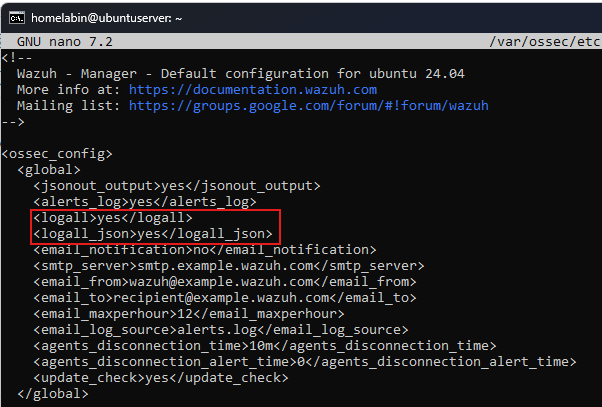

After restarting Wazuh and rerunning the Kali Nmap test, I confirmed that pfSense firewall events were present in `archives.json`. The events showed the expected source and destination IPs, destination ports, and Wazuh rule metadata for pfSense firewall drop activity.

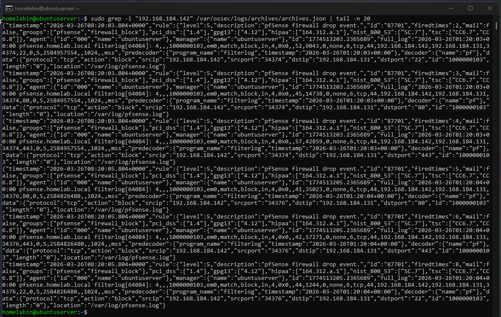

---

## Validation & Results

This project was considered successful when:

- pfSense local firewall logs were confirmed before forwarding
- pfSense successfully forwarded firewall events to the Ubuntu Wazuh server
- The Ubuntu server received and wrote the logs to `/var/log/pfsense.log`
- Kali-generated Nmap traffic appeared in the forwarded pfSense log file
- Wazuh logcollector confirmed it was analyzing `/var/log/pfsense.log`
- pfSense firewall events were confirmed in Wazuh archival logs

---

## Challenges & Observations

One challenge during this project was that pfSense events did not immediately appear where I first expected them in Wazuh. This required additional validation to determine whether the issue was forwarding, file monitoring, or Wazuh retention behavior.

By checking the Wazuh configuration and archival logs, I confirmed that the forwarding pipeline was working and that Wazuh was analyzing the pfSense log file correctly. This reinforced the importance of validating each stage of the pipeline instead of assuming a dashboard search reflects the full data path.

---

## What I Learned

This project helped reinforce:

- How firewall telemetry can be forwarded with syslog into a centralized logging workflow
- The importance of validating transport, file collection, and ingestion separately
- How to use rsyslog as a receiver for pfSense firewall events
- That Wazuh may require additional configuration changes to confirm event retention and visibility
- The value of using controlled test traffic instead of assuming logs are flowing correctly

---

## Security Relevance

In a SOC environment, this type of work supports:

- Network telemetry collection
- Visibility into blocked inbound connection attempts
- Detection of scanning and reconnaissance activity
- Validation of firewall log forwarding pipelines
- Investigation workflows that combine network security devices with centralized logging

This project helped improve my homelab’s network visibility and laid the groundwork for future firewall-focused detection and investigation projects.
