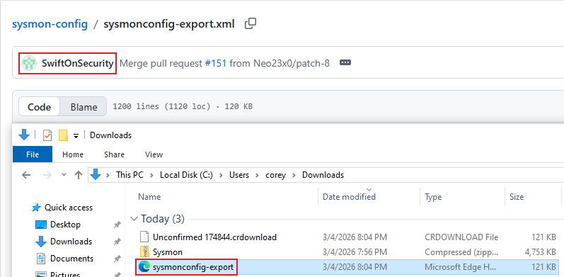
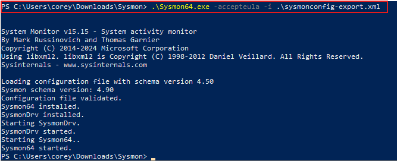
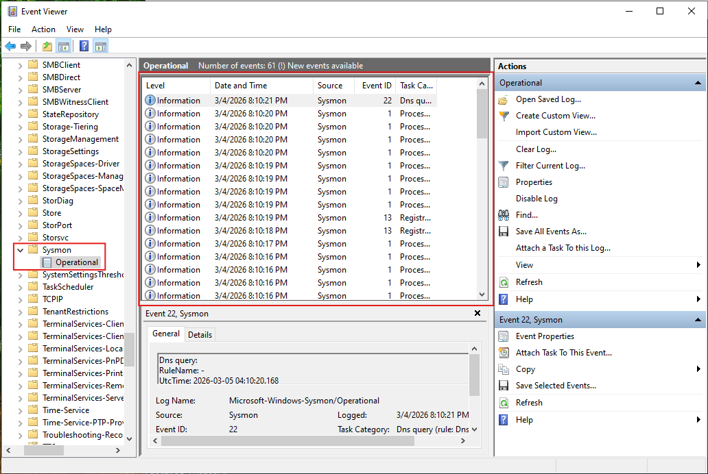
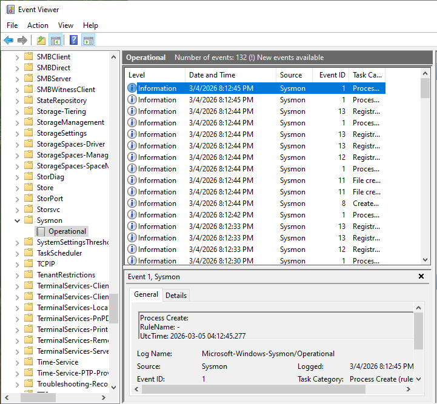
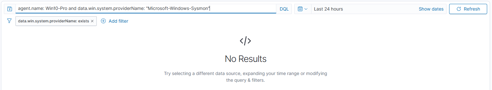
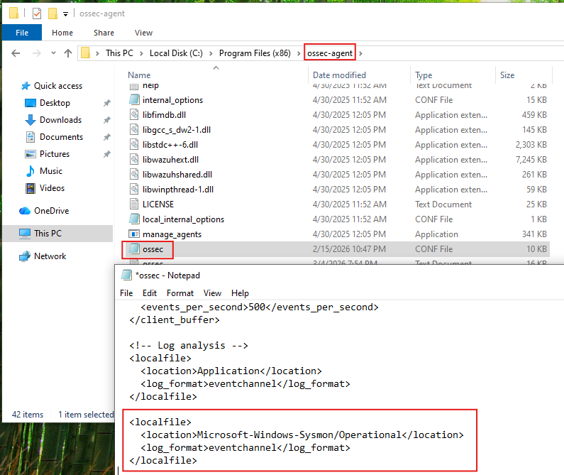
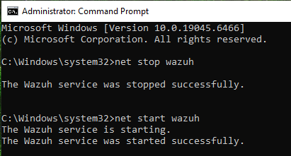
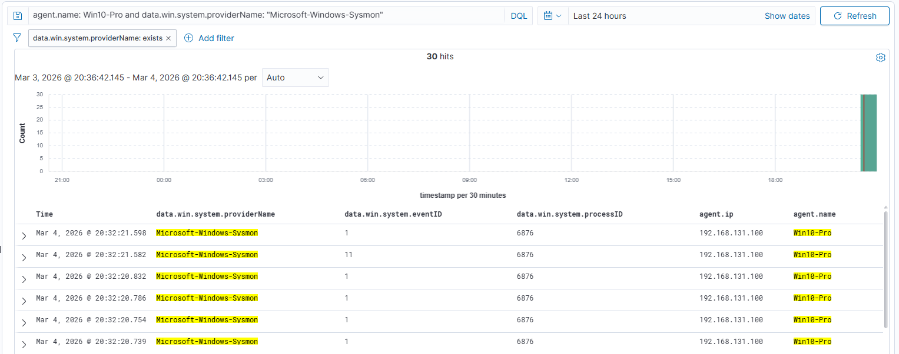

# Sysmon Baseline (Win10-Pro) – Telemetry to Wazuh

## Overview

This project documents hands-on work completed in my SOC homelab environment.

The objective of this project was to:

- Install Sysmon on the Windows 10 endpoint using a baseline configuration (SwiftOnSecurity)
- Enable collection of the Sysmon event channel on the Wazuh agent
- Validate Sysmon telemetry ingestion and visibility in Wazuh

This lab was built in a controlled environment to better understand how high-signal endpoint telemetry is generated, ingested, and analyzed in a SOC-style workflow.

---

## Environment

Systems involved in this project:

- Firewall: pfSense
- SIEM / Logging Platform: Wazuh (manager: 192.168.131.103)
- Endpoint(s): Windows 10 Pro (Agent name: Win10-Pro)
- Monitoring Tools: Windows Event Viewer, Wazuh Discover
- Network Segmentation (if applicable): LAN

---

## Project Goal

The goal of this project was to deploy Sysmon with a baseline configuration on a Windows 10 endpoint and ensure the Sysmon Operational event channel was being collected by Wazuh for SOC-relevant telemetry (process creation, file activity, etc.).

---

## Implementation Summary

High-level summary of what was configured or tested:

- Installed Sysmon with a baseline XML configuration (SwiftOnSecurity)
- Confirmed Sysmon events were generated locally in Event Viewer
- Updated Wazuh agent configuration to collect Sysmon Operational logs
- Restarted the Wazuh agent service to apply changes
- Verified Sysmon telemetry appeared in Wazuh Discover

---

## Evidence (Screenshots + Descriptions)

**SwiftOnSecurity Sysmon config downloaded and saved locally (XML file ready for install).**  

**Sysmon installed using the SwiftOnSecurity XML configuration (successful install output).**  

**Sysmon Operational log present and actively receiving events in Event Viewer.**  

**Example Sysmon Process Create event (Event ID 1) visible locally.**  

**Initial Wazuh Discover search showing no Sysmon results before channel collection was enabled.**  

**Wazuh agent configuration updated to collect `Microsoft-Windows-Sysmon/Operational` via eventchannel.**  

**Wazuh agent service restarted to apply the updated log collection configuration.**  

**Sysmon events successfully ingested and visible in Wazuh Discover after enabling the Sysmon channel.**  

---

## Validation & Results

This project was considered successful when:

- Sysmon events were visible locally in Event Viewer under Sysmon Operational
- Wazuh was configured to ingest the Sysmon Operational event channel
- Sysmon events were searchable in Wazuh Discover for the Win10-Pro agent
- Agent services remained stable after configuration changes

---

## Challenges & Observations

- Sysmon events were generated locally, but initially did not appear in Wazuh because the Sysmon Operational channel was not being collected.
- Adding the Sysmon event channel to the Wazuh agent configuration and restarting the service resolved ingestion.

---

## What I Learned

This project helped reinforce:

- Sysmon provides higher-signal endpoint telemetry than default Windows logs alone
- Log visibility in a SIEM depends on explicitly collecting the correct channels/sources
- Restarting services after config changes is often required to apply log collection updates
- Validating locally first (Event Viewer) helps isolate ingestion vs generation issues

---

## Security Relevance

In a SOC environment, Sysmon telemetry supports:

- Process execution monitoring (e.g., suspicious parent/child chains)
- Triage and investigation pivoting using process, file, and event metadata
- Improved detection engineering inputs compared to basic Windows logs alone
- Stronger endpoint visibility for future attack simulations and alerts

---
