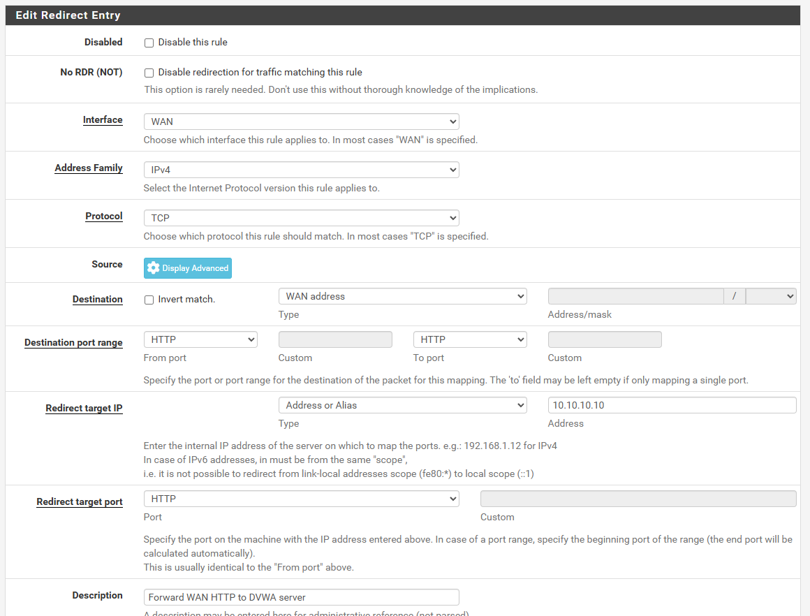
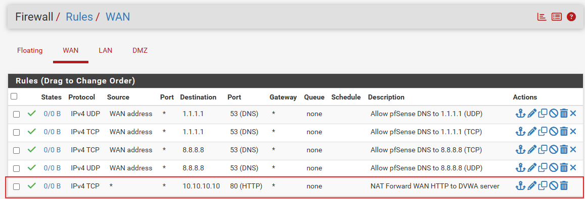
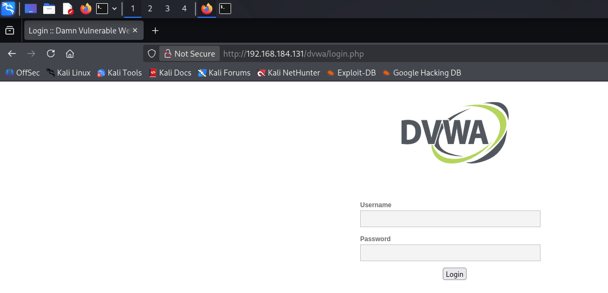
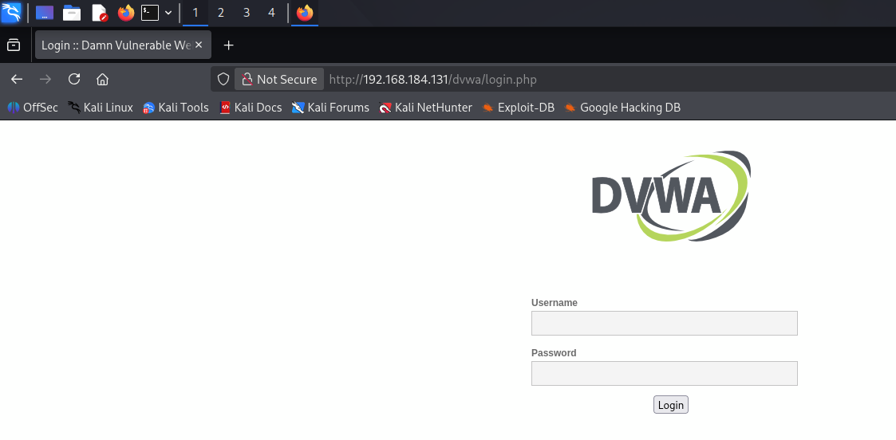
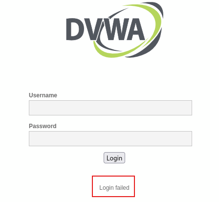
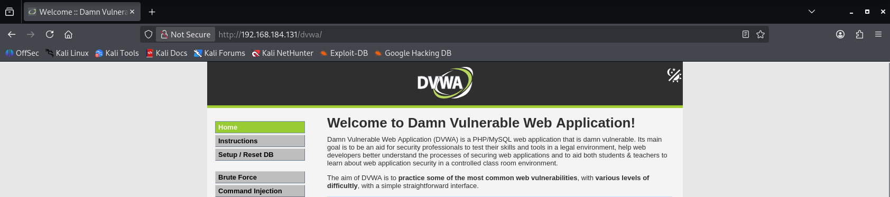
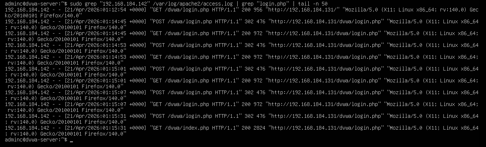
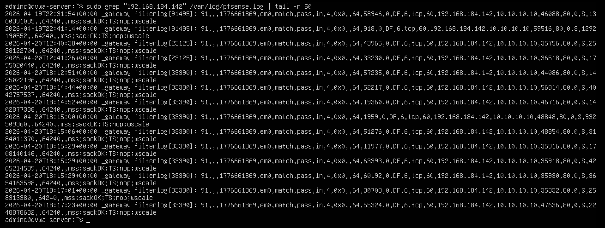
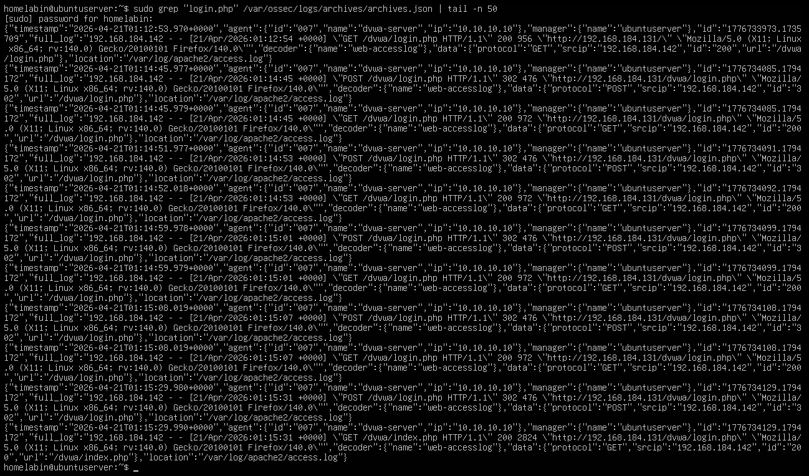
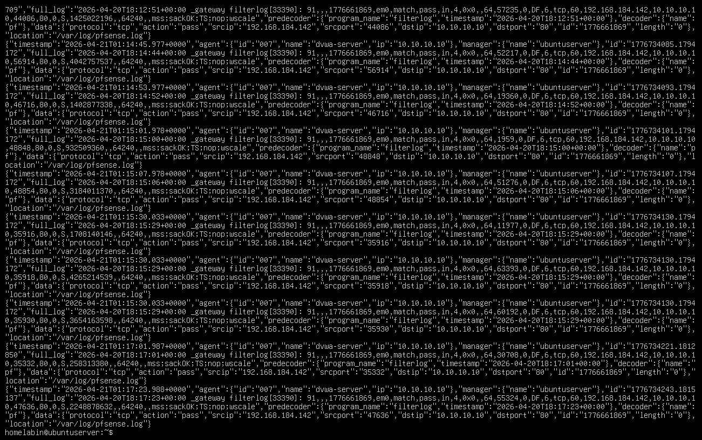

# Web Attack Detection and Investigation with DVWA + pfSense + Wazuh

## Overview

This project documents a web attack investigation completed in my SOC homelab environment.

The objective of this project was to:

- Simulate a controlled brute-force style login attack against DVWA from a Kali system
- Correlate web application and firewall evidence across Apache, pfSense, and Wazuh
- Validate that the attack activity could be investigated through SIEM data and archived raw logs

This lab was built in a controlled environment to better understand how web attacks appear across multiple log sources and how that activity can be reconstructed in a SOC-style investigation workflow.

---

## Environment

Systems involved in this project:

- Firewall: pfSense
- SIEM / Logging Platform: Wazuh
- Attacker System: Kali Linux
- Target System: Ubuntu Server 24.04.4 running DVWA
- Monitoring Tools: Wazuh agent, Apache access logs, pfSense remote logging, Wazuh archives
- Network Segmentation:
  - WAN: Kali
  - LAN: Wazuh server and internal systems
  - DMZ: DVWA server

### Key IP Addressing

- Kali: `192.168.184.142`
- pfSense WAN: `192.168.184.131`
- pfSense DMZ / Gateway: `10.10.10.1`
- Wazuh server: `192.168.131.103`
- DVWA server: `10.10.10.10`

---

## Project Goal

The goal of this project was to simulate a manual login brute-force sequence against DVWA and investigate the activity using multiple telemetry sources.

Rather than focusing on custom detection engineering, this lab focused on analyst-style investigation by correlating:

- Apache web access logs from the DVWA server
- pfSense firewall traffic logs forwarded to the DMZ host
- Wazuh archived raw logs for SIEM-side evidence
- Wazuh searchable event data where available

This project was designed to reflect a realistic SOC workflow where not every important event appears as a high-fidelity alert, and archived raw logs may be required to complete the investigation.

---

## Implementation Summary

High-level summary of what was configured and tested:

- Published DVWA through pfSense WAN to simulate realistic external access
- Generated repeated login attempts from Kali against `/dvwa/login.php`
- Confirmed Apache captured the repeated login sequence
- Confirmed pfSense logged matching WAN-to-DMZ HTTP traffic
- Validated that Wazuh archived both Apache and pfSense evidence for investigation
- Reconstructed the attack timeline using cross-source log correlation

---
## Firewall Rule Preparation

Before simulating the brute-force activity, I confirmed that DVWA was reachable from the WAN by publishing the web application through pfSense.

This required:

- a WAN port forward from the pfSense WAN IP to the DVWA server in the DMZ
- an associated WAN firewall rule permitting inbound HTTP traffic
- enabling logging on the NAT-associated WAN rule so the Kali-to-DVWA traffic would appear in pfSense firewall logs

This step was important because the investigation depended on seeing the same activity across:

- Apache web access logs on the DVWA server
- pfSense firewall logs
- Wazuh archived SIEM data

### WAN Port Forward to DVWA

I created a pfSense WAN port forward to send inbound HTTP traffic on the WAN interface to the DVWA server at `10.10.10.10:80`.

### Associated WAN Firewall Rule

pfSense automatically created the associated WAN firewall rule to allow the forwarded traffic. I also enabled logging on this rule so the inbound HTTP sessions from Kali would be recorded in pfSense logs for later investigation.

### Validation from Kali

After the port forward and firewall rule were in place, I confirmed that Kali could reach the DVWA login page through the pfSense WAN IP. This validated the external attack path used throughout the investigation.

---

## Step-by-Step Process

### Step 1 – Prepared the attack path for investigation

With the WAN port forward and associated firewall rule already validated, I confirmed that the external attack path from Kali to DVWA was ready for testing.

---

### Step 2 – Executed a controlled login brute-force sequence from Kali

From Kali, I performed a short manual login sequence against DVWA using the following credentials:

- `admin / wrongpass1`
- `admin / wrongpass2`
- `admin / wrongpass3`
- `admin / password`

This created repeated login attempts from a single external source IP while keeping the activity controlled and easy to trace through the logs.

Failed login attempts:

Successful login after repeated attempts:

---

### Step 3 – Collected Apache web access evidence from the DVWA server

After the attack sequence, I reviewed the Apache access log on the DVWA server and filtered for requests from the Kali IP to `login.php`.

The results showed:

- an initial `GET /dvwa/login.php`
- repeated `POST /dvwa/login.php` requests
- repeated returns to the login page
- a final `GET /dvwa/index.php`, supporting that valid credentials were eventually accepted

This provided the primary application-layer evidence for the investigation.

---

### Step 4 – Collected pfSense firewall evidence forwarded to the DVWA server

Because pfSense remote logging was configured to forward firewall events to the DVWA server, I reviewed `/var/log/pfsense.log` for connections from the Kali IP.

The forwarded firewall logs showed:

- source IP `192.168.184.142`
- destination IP `10.10.10.10`
- destination port `80`
- action `pass`

This confirmed that pfSense observed and allowed the inbound HTTP traffic used during the attack sequence.

---

### Step 5 – Validated Apache-side evidence in Wazuh archived logs

Because not all web activity appeared as normal alert data in the Wazuh web interface, I validated the same DVWA login activity in Wazuh archived raw logs.

The archived Apache events preserved:

- repeated requests to `/dvwa/login.php`
- source IP `192.168.184.142`
- log source `/var/log/apache2/access.log`
- the final transition to `/dvwa/index.php`

This was an important part of the investigation because it showed that SIEM archive data could still provide analyst visibility even when standard alert views were limited.

---

### Step 6 – Validated pfSense-side evidence in Wazuh archived logs

I also searched the Wazuh archives for pfSense `filterlog` events tied to the Kali IP. This showed the firewall-side network evidence preserved inside the SIEM backend.

The archived pfSense events showed:

- decoder name `pf`
- program name `filterlog`
- source IP `192.168.184.142`
- destination IP `10.10.10.10`
- destination port `80`
- action `pass`

This allowed direct correlation between the firewall telemetry and the Apache login activity.

---

## Validation & Results

This project was considered successful because:

- DVWA was reachable through pfSense WAN from the Kali attacker system
- repeated login attempts were visible in Apache access logs
- matching HTTP connections were visible in pfSense firewall logs
- Wazuh archived the Apache-side and pfSense-side evidence needed for investigation

This confirmed that the SIEM investigation path was working even without creating a custom brute-force detection rule.

---

## Challenges & Observations

A key observation during this lab was that not all relevant web activity surfaced as a standard Wazuh alert in `wazuh-alerts-*`.

In particular:

- Apache login activity was most useful in Wazuh archived raw logs rather than in normal alert views
- pfSense forwarded logs were easier to validate through local forwarded log files and archived SIEM data than through clean dashboard event searches
- Wazuh Discover searches sometimes surfaced my own investigative shell activity, such as `grep` commands, rather than the forwarded firewall events I was looking for

This reinforced the importance of validating where data is actually available instead of assuming every useful event will appear as a polished alert in the dashboard.

---

## What I Learned

This project helped reinforce:

- how published web services can be investigated through both application and firewall telemetry
- how repeated login activity can be reconstructed from Apache access logs
- how pfSense `filterlog` data can support network-side validation of suspected web attacks
- the difference between alert-level visibility and archived raw log visibility in a SIEM
- the importance of correlating multiple data sources before drawing conclusions about attack activity

---

## Security Relevance

In a SOC environment, this type of investigation supports:

- brute-force and password guessing investigations
- web application attack triage
- firewall and web log correlation
- validation of SIEM log visibility
- analyst workflows where archived raw logs must supplement standard alerts

This lab reflects a realistic defensive workflow by showing how an analyst can investigate suspicious activity even when the event does not neatly surface as a prebuilt alert.
