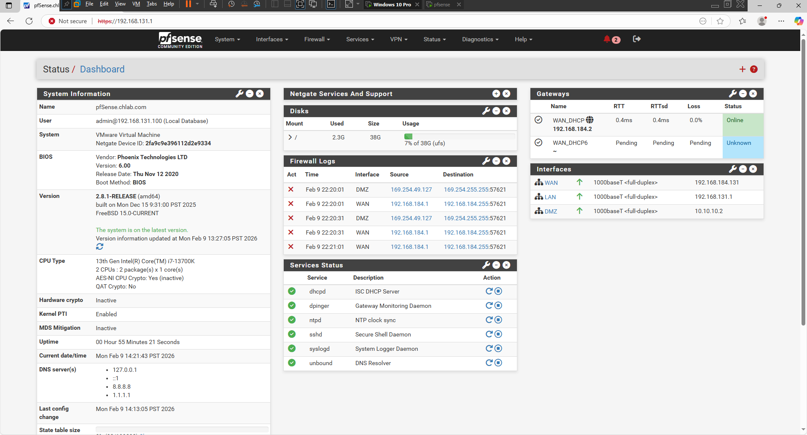
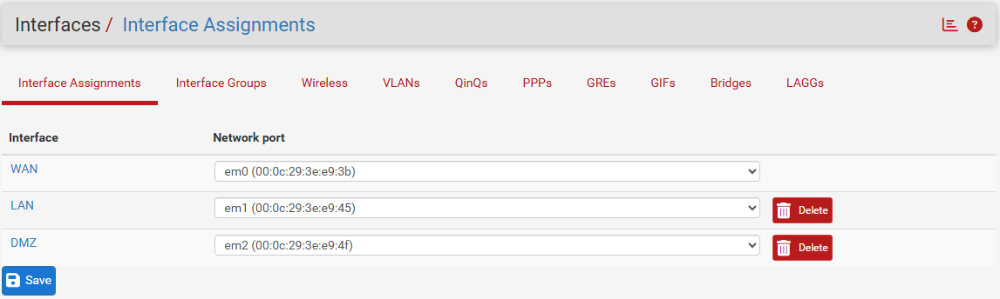
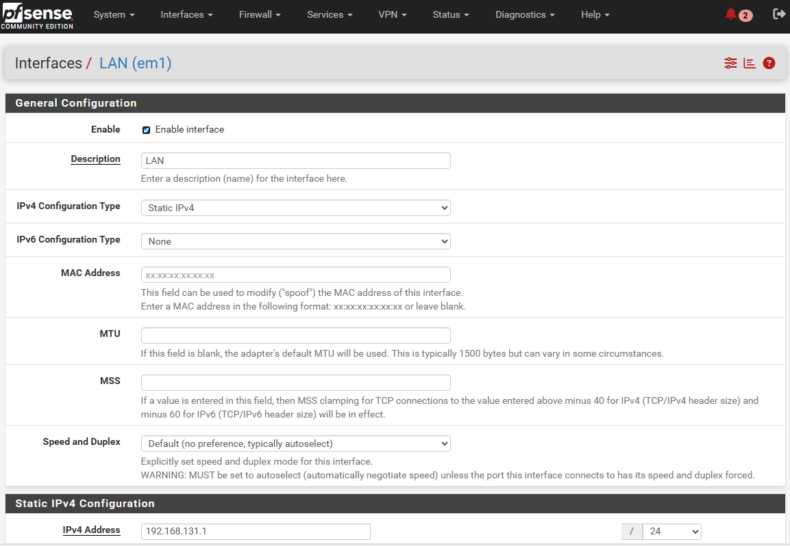
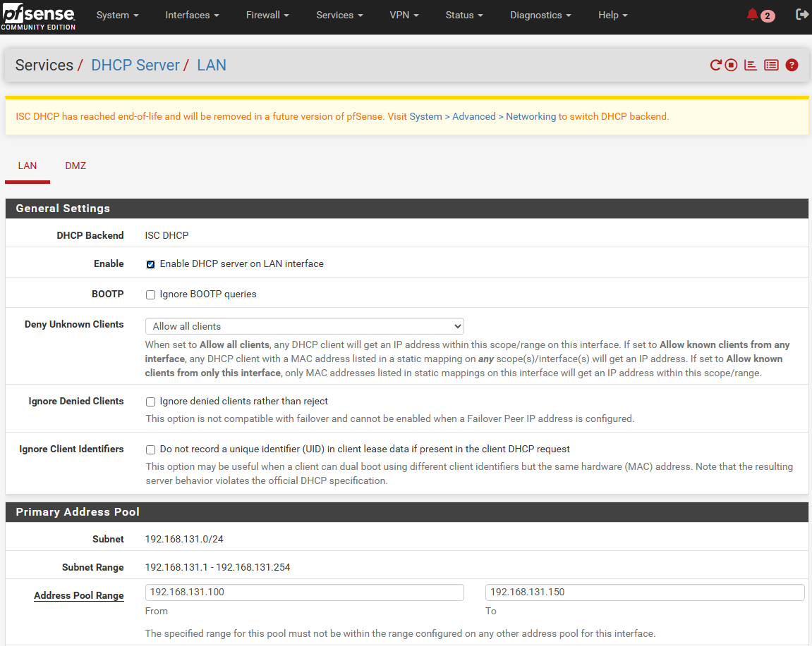
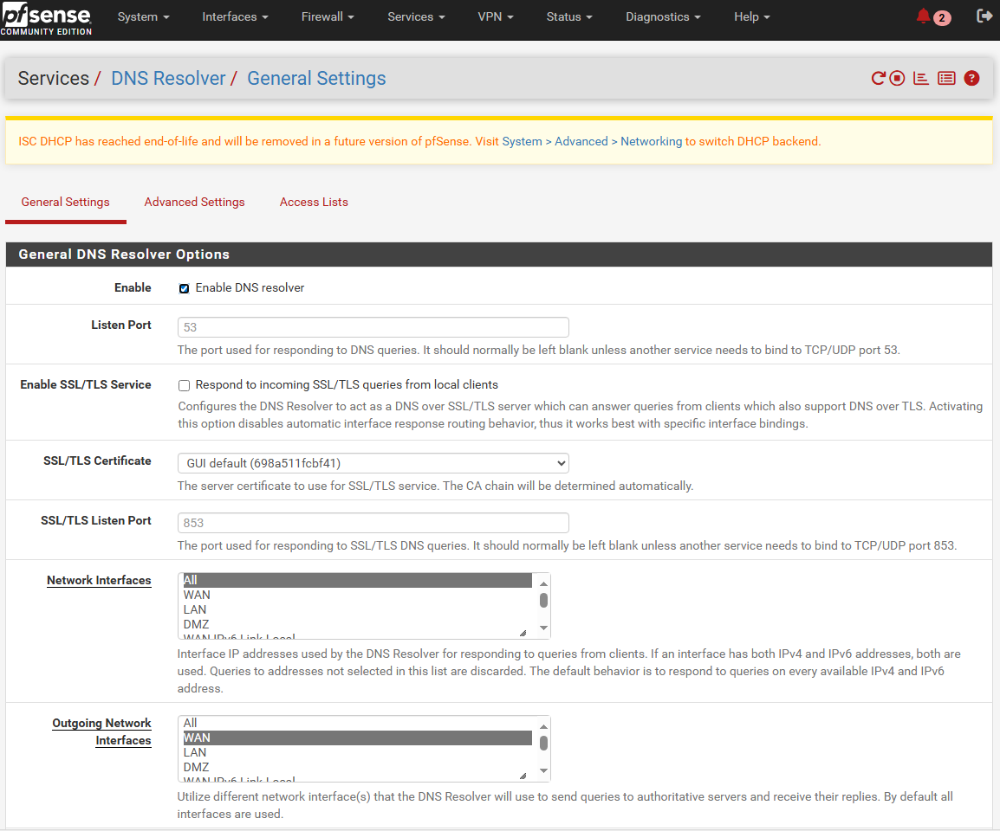
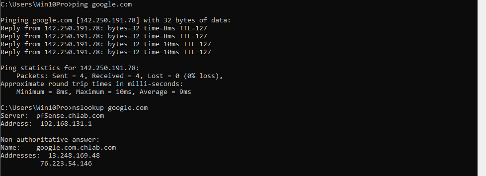

# 🔐 pfSense SOC Homelab

## 🎯 Purpose
This project establishes a segmented firewall environment to support **SOC-style monitoring, traffic analysis, and incident investigation**.  
The lab is designed to generate realistic network telemetry that can be analyzed during detection and response exercises.

---

## 🧭 Overview
The homelab uses **pfSense** as a perimeter firewall to separate **WAN, LAN, and DMZ** networks.  
This design mirrors common enterprise environments and provides controlled visibility into firewall activity, DNS resolution, and client behavior.

### Environment Status

The pfSense dashboard confirms interface status, gateway health, and active services such as DHCP and DNS resolution.

Key objectives:
- Enforce network segmentation
- Control and observe traffic flows
- Generate logs suitable for SIEM ingestion
- Validate end-to-end connectivity and DNS behavior

---

## 🧪 Lab Architecture

### Interface Assignments

pfSense interfaces are explicitly mapped to WAN, LAN, and DMZ networks to enforce segmentation and controlled traffic flow.

### Network Segmentation
- **WAN**: Simulated external network (attack and internet access)
- **LAN**: Internal user network (workstations and servers)
- **DMZ**: Semi-trusted network for exposed services and sensors

pfSense acts as the default gateway, DHCP server, DNS resolver, and NAT device for internal networks.

A topology diagram and configuration screenshots are available in the `screenshots/` directory.

---

## 🛡️ Firewall & Network Controls

### LAN Interface Configuration

The LAN interface is configured with a static IPv4 address to ensure consistent gateway behavior for internal clients.

The firewall configuration enforces:
- Default deny behavior on inbound WAN traffic
- Explicit allow rules for LAN outbound traffic
- Network Address Translation (NAT) for controlled internet access
- Segregation between LAN and DMZ networks

These controls allow the environment to safely simulate:
- External scanning attempts
- Legitimate internal traffic
- Restricted DMZ communication

---

## 🌐 DNS & DHCP Services

### DHCP Services

pfSense provides DHCP services for LAN clients, enabling device attribution and visibility into client activity.

### DNS Resolution

The DNS Resolver (Unbound) handles local name resolution and forwards external queries, generating telemetry useful for detecting suspicious domains.

This enables analysis of:
- DNS query behavior
- Potential malicious domain lookups
- Client-to-resolver relationships commonly reviewed in SOC investigations

---

## 🧾 Validation & Verification

### Client Connectivity Verification

LAN clients successfully obtain network configuration, reach external resources, and resolve DNS through pfSense.

The environment was validated through:
- Successful DHCP lease assignment to LAN clients
- Verified default gateway and DNS configuration
- Internet reachability via ICMP
- DNS resolution confirmed using `nslookup`

Screenshots documenting these checks are included as supporting evidence.

---

## 📊 SOC-Relevant Data Generated

This lab produces telemetry commonly analyzed by SOC teams, including:
- Firewall allow/deny logs
- DNS query logs
- DHCP lease records
- Client connection metadata

These logs form the foundation for future detection, alerting, and incident response exercises.

---

## ✅ Status

- ✔ Environment built
- ✔ Network segmentation enforced
- ✔ LAN connectivity verified
- ✔ Internet access and DNS resolution confirmed

This lab serves as the **baseline environment** for future SOC-focused projects such as:
- SIEM log ingestion
- Alert triage simulations
- Network-based threat detection
- Incident investigation workflows

---

## 📌 Notes

This project prioritizes **observability and investigation readiness** over complex configurations.  
Each design choice was made to support realistic SOC analysis rather than purely networking experimentation.
