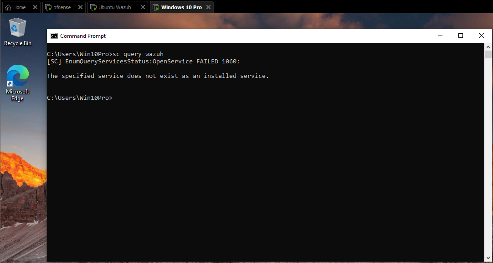
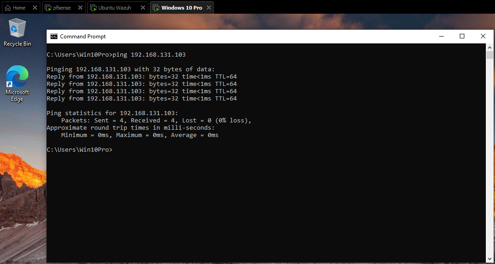
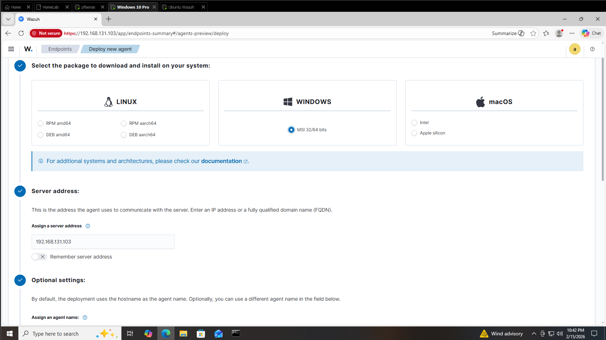
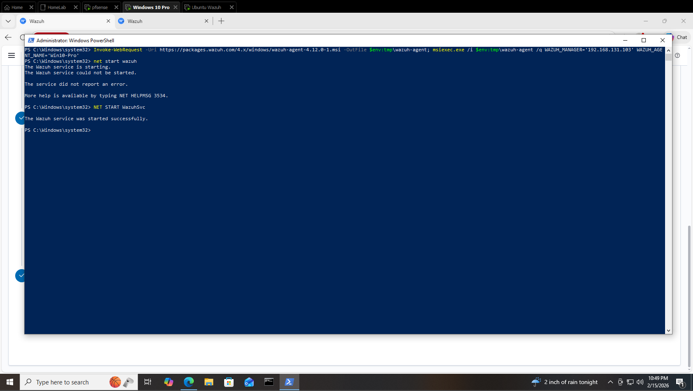
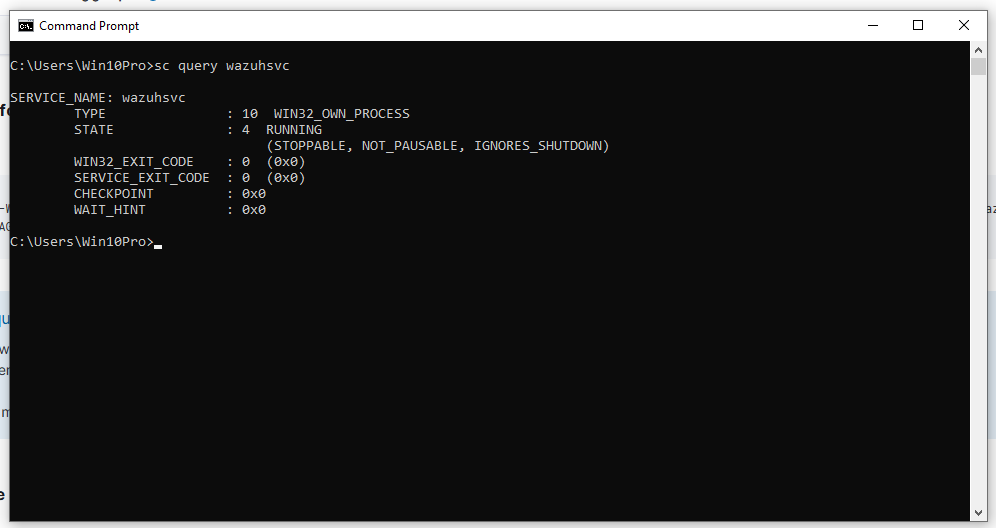
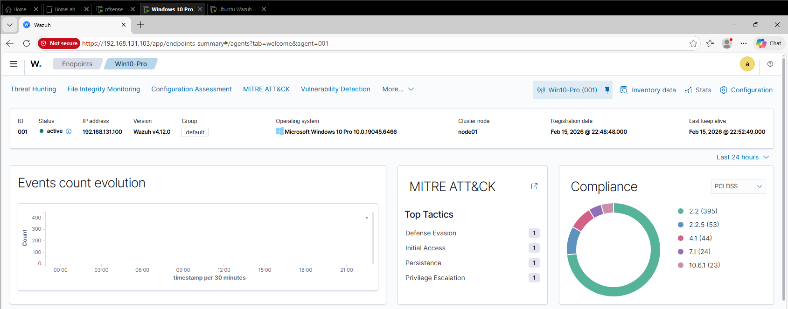

# Wazuh Agent Deployment – Windows 10

## Purpose

This project documents deploying a Wazuh agent to a Windows 10 endpoint in my SOC homelab.

The goal was to:
- Connect the endpoint to the Wazuh manager
- Confirm agent registration
- Verify security event ingestion

---

## Pre-Deployment Verification

Before installing the agent, I confirmed it was not already present and verified connectivity to the Wazuh server.

### Service Check (No Agent Installed)

### Connectivity Test to Wazuh Server

---

## Agent Installation

The deployment command was generated from the Wazuh dashboard.

### Deployment Page

### Generated Install Command

### Installation Output

---

## Service Verification

After installation, the Wazuh service was started and confirmed running.

---

## Agent Registration

The Windows 10 endpoint successfully registered in the Wazuh dashboard.

---

## Log Ingestion Verification

Initial security events from the Windows endpoint were visible in Wazuh.

---

## Result

The Windows 10 endpoint is now fully integrated with Wazuh and generating telemetry.  

This sets the foundation for future detection and investigation exercises.

