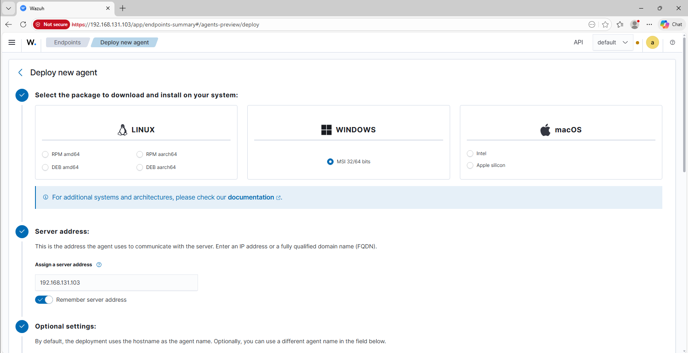
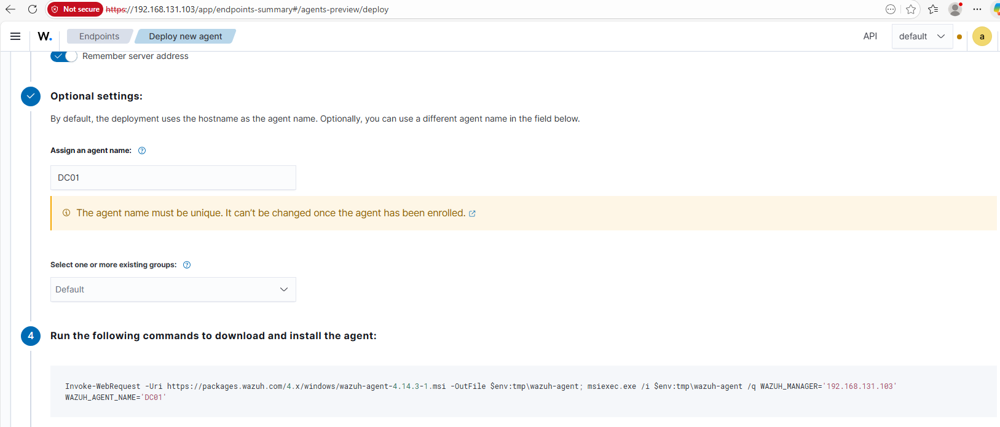
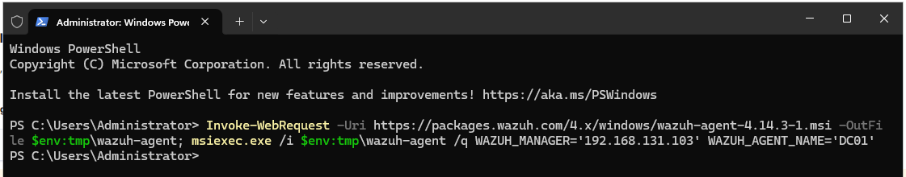
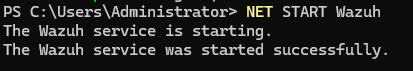
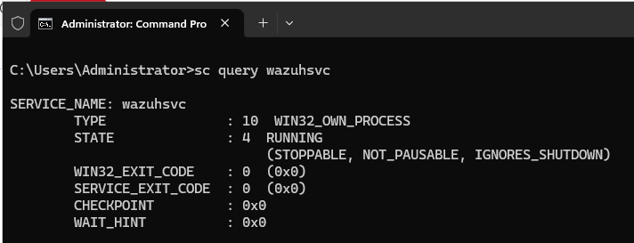
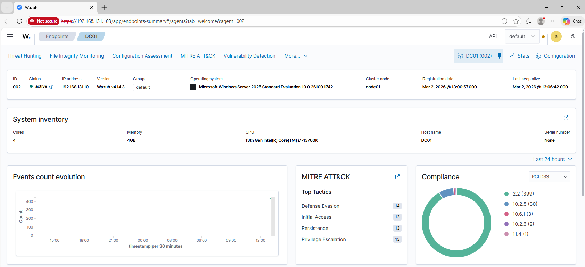
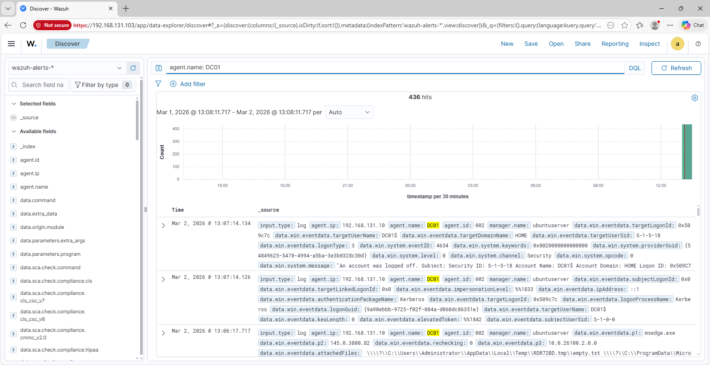

# Wazuh Agent Deployment – DC01 (Windows Server)

## Purpose

This project documents deploying a Wazuh agent to my Windows Server domain controller (DC01) in my SOC homelab.

The goal was to:
- Connect DC01 to the Wazuh manager
- Confirm agent registration
- Verify initial log ingestion from the server

---

## Agent Installation

The deployment command was generated from the Wazuh dashboard and executed on DC01.

### Deployment Page

### Generated Install Command

### Installation Command Execution

---

## Service Verification

After installation, the Wazuh agent service was started and confirmed running.

### Service Start

### Service Running

---

## Agent Registration

DC01 successfully registered and reported as active in the Wazuh dashboard.

---

## Log Ingestion Verification

Initial logs from DC01 were visible in Wazuh after enrollment.

---

## Result

DC01 is now integrated with Wazuh and generating telemetry.

This expands visibility to include domain controller activity for future authentication and AD-focused detections.
