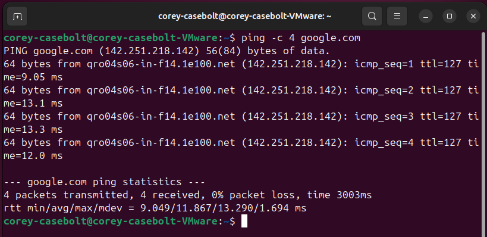
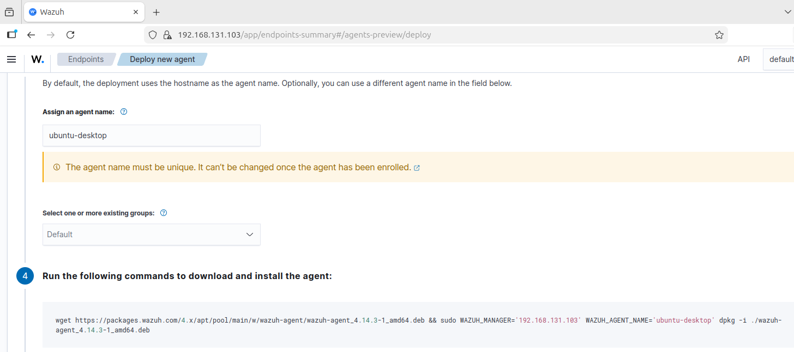
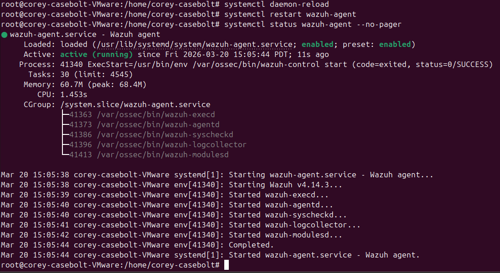
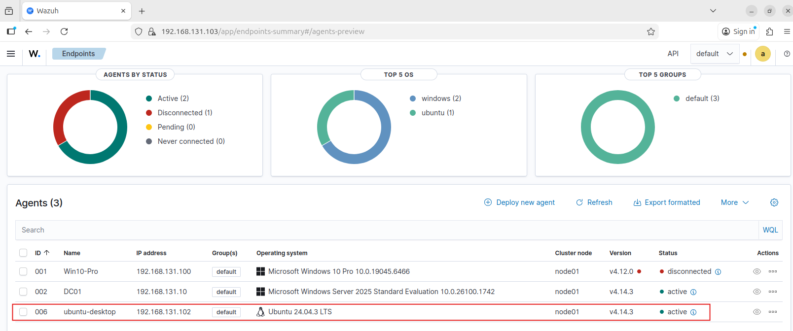
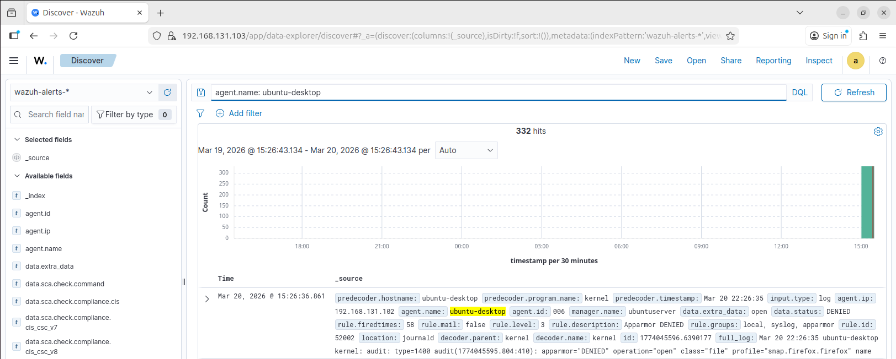

# Wazuh Agent Deployment – Ubuntu Desktop

## Overview

This project documents deploying a Wazuh agent to an Ubuntu Desktop endpoint in my SOC homelab.

The objective of this project was to:

- Connect a Linux endpoint to the Wazuh manager
- Confirm successful agent enrollment and active status
- Verify Linux telemetry ingestion in the Wazuh dashboard

This lab was built in a controlled environment to better understand how endpoint telemetry is collected and validated in a SOC-style workflow.

---

## Environment

Systems involved in this project:

- Firewall: pfSense
- SIEM / Logging Platform: Wazuh
- Endpoint(s): Ubuntu Desktop
- Monitoring Tools: Wazuh agent
- Network Segmentation: LAN segmented behind pfSense

---

## Project Goal

The goal of this project was to deploy a Wazuh agent to an Ubuntu Desktop system, register it with the Wazuh manager, and confirm that Linux endpoint telemetry was successfully being ingested into the platform.

This project also helped reinforce Linux agent deployment steps and basic troubleshooting during enrollment.

---

## Implementation Summary

High-level summary of what was configured and validated:

- Verified network connectivity from Ubuntu Desktop
- Generated the Linux deployment command in the Wazuh dashboard
- Installed and started the Wazuh agent on Ubuntu Desktop
- Confirmed the agent appeared as active in Wazuh
- Verified Linux telemetry was visible in Discover

---

## Step-by-Step Process

### Step 1 – Verified Network Connectivity

Before installing the agent, I confirmed the Ubuntu Desktop endpoint had working network connectivity to the Wazuh manager and internet access.

---

### Step 2 – Generated the Linux Agent Deployment Command

From the Wazuh dashboard, I selected the Linux deployment option for Ubuntu Desktop and generated the installation command for the new endpoint.

---

### Step 3 – Installed and Started the Wazuh Agent

I ran the deployment command on the Ubuntu Desktop endpoint, started the Wazuh agent service, and confirmed that the service was running successfully.

---

### Step 4 – Confirmed Agent Registration in Wazuh

After installation, I verified that the Ubuntu Desktop endpoint successfully enrolled in the Wazuh dashboard and showed an active status.

---

### Step 5 – Verified Linux Telemetry Ingestion

To validate that the deployment was working correctly, I reviewed Wazuh Discover data for the Ubuntu endpoint and confirmed that Linux telemetry was being indexed and displayed.

---

## Validation & Results

This project was considered successful when:

- The Ubuntu Desktop endpoint successfully enrolled with the Wazuh manager
- The Wazuh agent service remained running on the endpoint
- The agent appeared as active in the Wazuh dashboard
- Linux telemetry from the endpoint was visible in Wazuh Discover

The Ubuntu Desktop endpoint is now integrated into the lab’s monitoring environment and can be used in future Linux-focused monitoring and detection exercises.

---

## Challenges & Observations

One issue encountered during deployment was that the agent initially failed to start because the configuration file still contained the placeholder value `MANAGER_IP` instead of the actual Wazuh server IP address.

I also ran into some confusion around agent naming. By default, the agent initially enrolled using the host’s existing system name. I corrected this by updating the enrollment configuration so the endpoint registered with the intended agent name.

These issues were useful reminders to verify configuration values carefully and validate enrollment settings when reinstalling an agent.

---

## What I Learned

This project helped reinforce:

- How Linux endpoints are enrolled into Wazuh
- The importance of validating agent configuration after installation
- How agent naming and enrollment behavior can affect dashboard visibility
- How to confirm successful telemetry ingestion after deployment

---

## Security Relevance

In a SOC environment, this type of project supports:

- Endpoint visibility across Linux systems
- Validation of log ingestion from non-Windows assets
- Monitoring coverage across multiple operating systems
- Better preparation for Linux-based detection and investigation workflows
