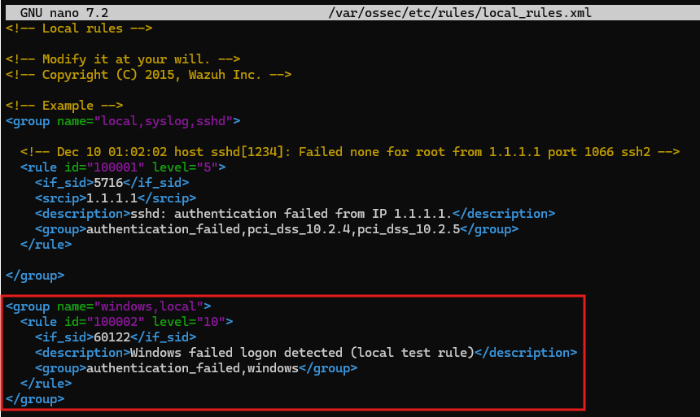
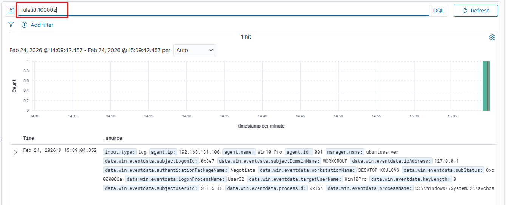
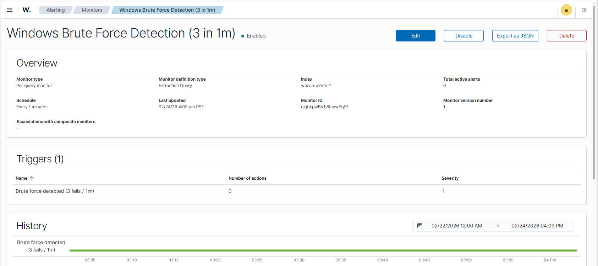
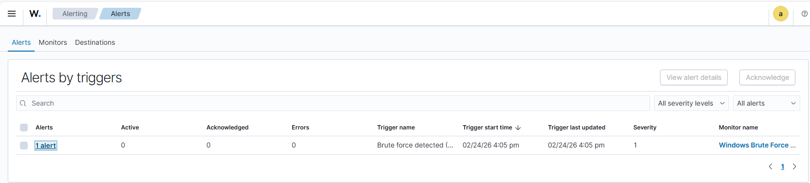
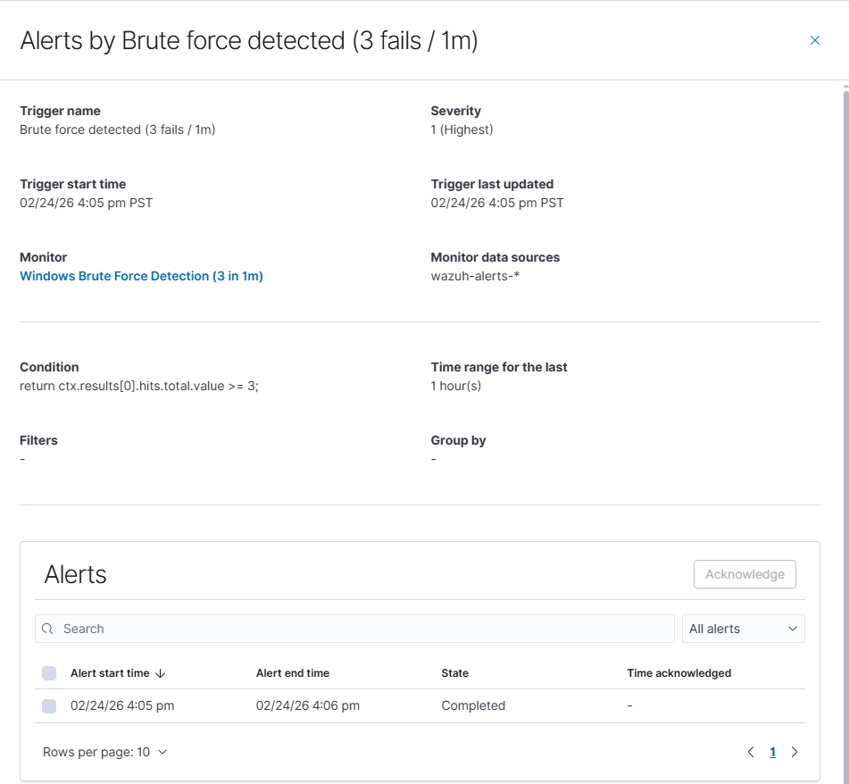

# Windows Brute Force Detection – Threshold Alert (3 Failed Logons in 1 Minute)

## Purpose

This project documents building and validating a brute force detection in my SOC homelab using Wazuh and OpenSearch.

The goal was to:

- Create a custom child rule for failed Windows logons
- Build a threshold-based alert (3 failed logons in 1 minute)
- Simulate a brute force attempt
- Confirm an alert is generated in the dashboard

This simulates how a SOC team might detect repeated authentication failures that indicate credential guessing activity.

---

## Step 1 – Create Custom Wazuh Rule

A child rule (`100002`) was created to chain from the existing Windows failed logon rule (`60122`) using `<if_sid>`. This allows failed logon events to be tagged with a custom rule ID for monitoring.

<group name="windows,local">
  <rule id="100002" level="10">
    <if_sid>60122</if_sid>
    <description>Windows failed logon detected (local test rule)</description>
    <group>authentication_failed,windows</group>
  </rule>
</group>

### Custom Rule in local_rules.xml

---

## Step 2 – Validate Events in Discover

After generating multiple failed login attempts on the Windows endpoint, I verified that events were indexed under:

` rule.id:100002`

This confirmed:

- The child rule was firing correctly
- The events were searchable
- Log ingestion from the Windows endpoint was working

### Discover Validation

---

## Step 3 – Create Threshold Monitor

A **Per Query Monitor** was created in OpenSearch to detect multiple failed logons within a short timeframe.

**Index Used:**

` wazuh-alerts-*`

**Detection Logic:**

- Evaluate events from the last 1 minute
- Count events where `rule.id = 100002`
- Trigger alert if count ≥ 3

The monitor was configured to run every 1 minute and evaluate the threshold condition automatically.

### Monitor Configuration

---

## Step 4 – Simulate Brute Force Activity

To simulate a brute force scenario, multiple failed login attempts were generated within one minute on the Windows endpoint.

The monitor ran on its 1-minute schedule and successfully generated an alert.

### Alert Fired in Dashboard

### Alert Details

---

## Key Findings

- The custom child rule correctly chained from the parent failed logon rule.
- Failed logon events were indexed and searchable in Discover.
- The threshold monitor correctly evaluated event counts.
- The alert triggered automatically when 3 failed logons occurred within one minute.
- The detection workflow was validated end-to-end.

---

## MITRE ATT&CK Mapping

- **T1110 – Brute Force**
- Tactic: Credential Access

---

## Why This Matters

Repeated failed login attempts are commonly associated with:

- Brute-force attacks
- Password spraying
- Unauthorized access attempts
- Suspicious account activity

This project demonstrates how SIEM detections can be built, tested, and validated to identify suspicious authentication behavior in a SOC environment.

---

## Result

The brute force detection was successfully:

- Built using a custom Wazuh rule
- Configured using an OpenSearch threshold monitor
- Validated through controlled failed login testing
- Confirmed through automated alert generation
