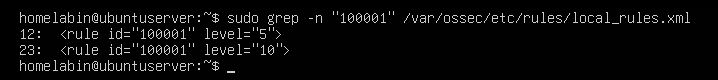
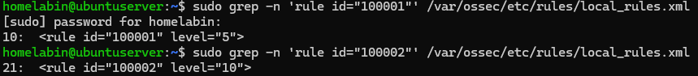
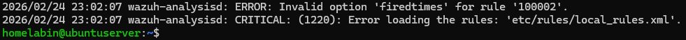
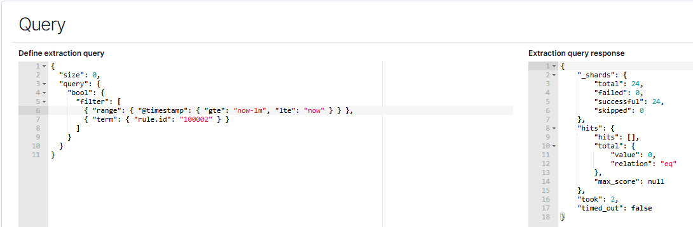

# Troubleshooting – Windows Brute Force Threshold Detection

## Overview

During the implementation of the Windows brute force threshold detection, several issues occurred that required step-by-step troubleshooting.

This document outlines the problems encountered, how they were investigated, and what was learned throughout the process.

The goal was not only to get the detection working, but to understand why certain configurations failed and how to resolve them methodically.

---

## Issue 1 – Wazuh Manager Failed to Restart (Duplicate Rule ID)

After creating a custom rule, the Wazuh manager failed to restart.

### Symptom

The service would not start after editing `local_rules.xml`.

### Investigation

The service status and logs were reviewed using:

```
sudo systemctl status wazuh-manager
sudo journalctl -xeu wazuh-manager
```

The logs indicated a rule parsing error related to duplicate rule IDs.

### Screenshot – Duplicate Rule Error


### Resolution

Two rules were using the same ID (`100001`).  
The custom rule was updated to use a unique ID (`100002`).

### Screenshot - Duplicate Rule Name Correction


After correcting the rule ID and validating the file, the manager successfully restarted.

### What I Learned

- Wazuh requires all rule IDs to be unique.
- Even small configuration mistakes can prevent the entire service from starting.
- Checking logs immediately is critical when services fail.

---

## Issue 2 – Invalid Rule Options (frequency / firedtimes)

While attempting to create a correlation rule inside Wazuh, I initially tried using options such as:

- `<frequency>`
- `<timeframe>`
- `<firedtimes>`

### Symptom

The Wazuh manager failed to restart and returned:

```
Invalid option 'frequency' for rule '100002'
```

### Screenshot – Rule Parsing Failure


### Investigation

The rule syntax was tested using:

```
sudo /var/ossec/bin/wazuh-analysisd -t
```

This confirmed that the rule options were not supported in this context.

### Resolution

Instead of implementing threshold logic directly in Wazuh, the approach was simplified:

- Keep a basic child rule using `<if_sid>`
- Move threshold logic to an OpenSearch monitor

This allowed the detection to function correctly without causing rule parsing failures.

### What I Learned

- Not all rule options are valid in every deployment.
- When configuration changes repeatedly fail, simplify the approach.
- Validate configuration files before restarting services.

---

## Issue 3 – Monitor Returning 0 Results

After creating the OpenSearch monitor, the query initially returned zero hits.

### Symptom

The monitor showed:

```
hits.total.value: 0
```

Even though failed login attempts were being generated.

### Investigation

Using Discover, I verified:

- The correct field was `rule.id`
- Events were now indexed under `100002`
- The monitor query needed to reference the correct rule ID

### Screenshot – Query Returning 0 Results


### Resolution

The query was updated to match:

```
rule.id:100002
```

After adjusting the query and re-testing, the monitor returned the expected event counts and successfully triggered an alert.

### What I Learned

- Always verify data in Discover before assuming the alert is broken.
- Field names and data types matter.
- Testing queries manually helps isolate detection issues.

---

## Final Working State

After resolving the issues:

- The custom rule (`100002`) loaded successfully.
- Failed login events were searchable.
- The threshold monitor triggered correctly at 3 failed logons within 1 minute.
- Alerts appeared in the Alerting dashboard.

---

## Common Beginner Mistakes (Lessons Learned)

While working through this project, I encountered several common mistakes that are easy to make when learning SIEM configuration:

- Reusing rule IDs without realizing they must be unique.
- Editing configuration files without validating syntax first.
- Assuming threshold logic should always be implemented at the rule level.
- Not checking service logs immediately after a restart failure.
- Forgetting to confirm which rule ID is actually being indexed.

Understanding these mistakes helped reinforce the importance of:

- Incremental testing
- Reading error messages carefully
- Validating configuration changes before proceeding
- Using Discover to confirm data visibility

---

## Reflection

This troubleshooting process strengthened my understanding of how Wazuh processes rules and how OpenSearch evaluates alert conditions.

Although the configuration required multiple adjustments, working through each issue step-by-step improved my confidence in:

- Reviewing service logs
- Testing rule syntax
- Validating detection logic
- Adjusting strategy when an approach fails

This experience reinforced that troubleshooting is a normal and important part of building effective SIEM detections.
