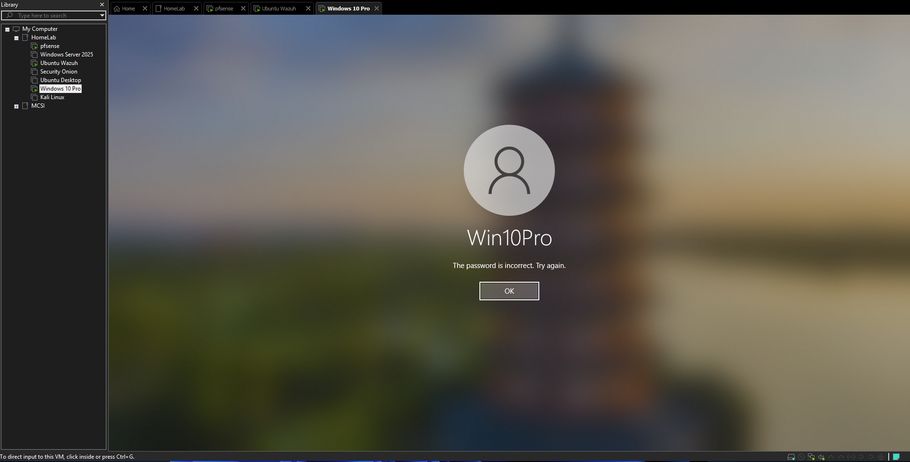
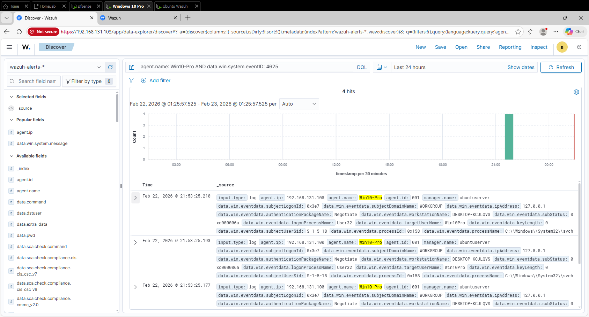
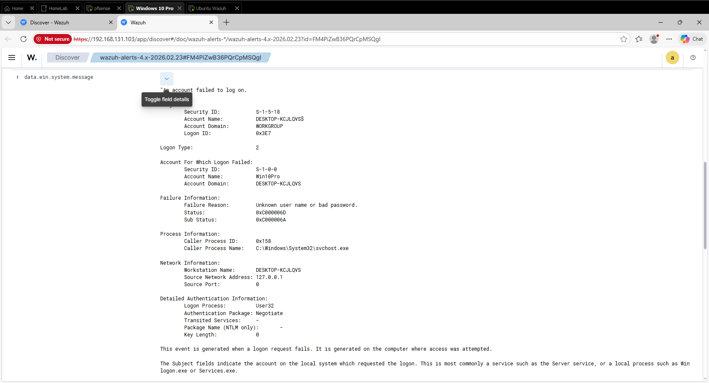

# Failed Login Detection – Windows 10 (Event ID 4625)

## Purpose

This project documents generating and analyzing a failed Windows login attempt inside my SOC homelab.

The goal was to:

- Trigger a known security event
- Confirm it was ingested by Wazuh
- Review the event details like a SOC analyst would

---

## Step 1 – Generate Failed Login

On the Windows 10 endpoint, I attempted to log in with the correct username but incorrect password multiple times.

### Failed Login on Windows

---

## Step 2 – Locate Event in Wazuh

In the Wazuh Discover view, I filtered for:
agent.name: Win10-Pro AND data.win.system.eventID: 4625

This returned multiple failed login events.

### Failed Login Events in Wazuh

---

## Step 3 – Review Event Details

After expanding one of the events, I reviewed key fields:

- Event ID: 4625
- Logon Type: 2 (Interactive)
- Account Name
- Failure Reason
- Source Network Address
- Process Name

### Event Detail View

---

## Key Findings

- The event correctly shows a failed interactive login.
- The failure reason was "Unknown user name or bad password."
- The source address was local (127.0.0.1), meaning the login attempt was performed directly on the machine.
- The event was successfully forwarded from the Windows endpoint to the Wazuh manager.

---

## Why This Matters

Failed login events are commonly reviewed in SOC environments to detect:

- Brute-force attempts
- Password spraying
- Unauthorized access attempts
- Suspicious account activity

This confirms that my Wazuh deployment is properly collecting and indexing Windows security events.

---

## Result

The failed login attempt was successfully:

- Generated on the endpoint
- Forwarded by the Wazuh agent
- Indexed by the Wazuh manager
- Searchable and reviewable in the dashboard

This marks the first verified detection workflow in my homelab.
